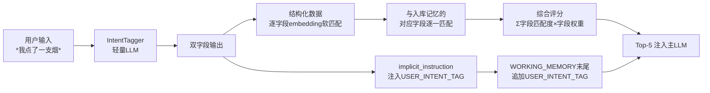

# AURA — 30天完整执行计划

> 项目代号：**AURA** (Agentic Unified Roleplay Assistant)
> 目标：面试用 + 自己用（ST/Tavo 重度用户，氪金数千）
> 原则：纯后端、不做前端、不做调包侠
> 时间线：30天（五一5天骨架 + 3周血肉 + 1周面试武器）
> 面试日期：五月底

---

## 一、项目愿景

> "即使世界忘了角色的誓言，AURA 也会替他们记住。"

**给 我心爱的角色 一个赛博老家。**

---

### 💎 核心宣言

> **AURA 不是"速度工具"，而是一个"Prompt 编译器"——将 TAVO 的混沌输入 + 用户的 RP 意图，编译成 DeepSeek/Qwen 能正确执行的指令，输出 Sonnet 级别的沉浸体验。**

> **AURA 的终极形态不是"DeepSeek 的代理"，而是"Sonnet 的行为模拟器"——用 Prompt 工程 + 质量控制系统，让任何国产模型都能输出 Sonnet 级别的 RP 质量。**

---

### 用户愿意付出的代价

对于重度 RP 用户来说：
- ❌ 他们**不愿忍受** DeepSeek 用 0.5 秒吐出一段越权替他们写台词的回复
- ✅ 他们**愿意等待** 30 秒让 Gemini 慢慢生成一个完美的情节点
- ❌ 他们**不愿接受** API 运营商（OpenRouter 等）锁国区、封禁国内支付方式
- ✅ 他们**愿意折腾** 配置 AURA，只要能获得稳定、高质量的 RP 体验

**核心洞察**：这些用户宁愿多花钱也要用 Sonnet，不是因为 Sonnet 快，而是因为 Sonnet 准——它不越权、不抢戏、文风干净、沉浸感强。**AURA 要做的不是让用户更快地拿到回复，而是让 DeepSeek/Qwen  behave（行为）像 Sonnet。**

---

### AURA 的本质定位：角色扮演专用的 Prompt 编译器 + 模型行为校正引擎

```
TAVO ──→ AURA（Prompt 编译器）
              ├── 输入层：拆解 TAVO 的混沌 Prompt（角色卡 + 长记忆 + 世界书 + 用户设定混杂）
              ├── 编译层：模型方言编译器（DeepSeek/Qwen/Gemini 各自需要不同的指令格式）
              ├── 记忆层：RAG 语义召回（替代全量注入，314条 → Top-5）
              ├── 状态层：StateManager 强制注入（防止怀孕→生完→又怀孕）
              ├── 质检层：生成后检测越权/长度/OOC，不通过则重写
              └── 输出层：重组为标准化区块 Prompt + 模拟 SSE 流式返回
```

用户只需在 TAVO 中配置一个 API 地址（AURA），所有流量都经过 AURA。AURA 内部负责：
- **模型切换**：DeepSeek / Kimi / Gemini / Qwen / ...
- **Prompt 编译**：将 TAVO 格式转换为各模型能理解的"方言"
- **记忆管理**：SQLite + FAISS RAG，替代 TAVO 的全量记忆注入
- **行为校正**：输出长度控制、越权检测、状态一致性校验

**用户无感知，但体验质变。**

### 核心策略：拆解 → 编译 → 重组

AURA 的核心工作流程是 **"拆解 → 编译 → 重组"**：

1. **拆解**：将 TAVO 发送的原始 Prompt（System Prompt 中混杂了越权禁令、长记忆、角色卡、世界书、USER设定等）按格式标记拆解为结构化组件
2. **编译**：对各组件应用模型专属优化策略（DeepSeek 需要元角色伪装、Gemini 需要反抢戏指令、Qwen 需要特定格式约束），并叠加质量控制策略（RAG压缩、StateManager注入、两头约束等）
3. **重组**：将编译后的组件重新组装为针对目标模型最优的 Prompt 发送给 LLM

> 由于 TAVO 是闭源软件，无法在其输出中添加自定义字段，因此采用 **"格式拆解 + 区块重组"** 策略——通过硬解析识别 System Prompt 中的各区域边界，重组为 **9 个标准化区块**（v0.8.0），并应用"两头约束"（开头 Priming + 结尾 Recency Effect）。

---

## 二、14 个系统性痛点

宋作为重度 RP 用户，真金白银买来的真实体验：

| # | 痛点 | 五一 | 节后 |
|---|------|------|------|
| 1 | **越权输出** — 模型替 user 写台词/行动 | ✅ | — |
| 2 | **文风污染** — 垃圾小说训练痕迹（臀腿腰胸） | — | Week 2 |
| 3 | **文风固化** — 长时间同一模型锁死 | — | Week 3 |
| 4 | **状态回退** — 怀孕→生完→又怀孕 | ✅ | — |
| 5 | **RPG剧情回退** — 主线被带回过去 | — | Week 2 |
| 6 | **内心独白泄露** — LLM像有读心术 | — | Week 3 |
| 7 | **跨角色记忆隔离** — 私密话共享 | — | Week 3 |
| 8 | **RPG多角色状态记录缺失** — 长记忆只记 user 一人，party/NPC 状态变化全丢 | ✅ | — |
| 9 | **重复记忆/冗余信息** — 同一批 NPC 信息被 LLM 反复记录，提示词无法根治 | ✅ | — |
| 10 | **长记忆无 RAG，全量注入** — ST/Tavus 把全部 summary 塞进 system prompt，token 浪费 + 注意力稀释 | — | Week 2 |
| 11 | **模型输出太少** — DeepSeek 输出过短，剧情推不下去 | — | Week 2 |
| 12 | **模型输出太多** — Gemini 输出过长，经常自己推进剧情 | — | Week 2 |
| 13 | **系统提示词锁不住** — 写了明确的 system prompt，LLM 仍会偏离人设 | — | Week 3 |
| 14 | **时间维度缺失 → 已完成事件重复生成** — 长记忆无时间戳/时序标记，已完结剧情被反复重新生成 | — | Week 3 |
| 15 | **用户输入意图隐含 → LLM 默认接话而非渲染反应** — 用户输入 `*我点了一支烟*` 时期待的是他人反应，LLM 却替 user 生成后续行动或台词。用户不会写"请输出其他人的表现"，但 RP 体验需要 LLM "读空气" | — | 未来 |

---

## 三、技术栈

| 层级 | 选型 | 说明 |
|------|------|------|
| API 网关 | FastAPI + Pydantic + Uvicorn | OpenAI-compatible `/v1/chat/completions` |
| 模型层 | httpx 直连 | 多后端切换（DeepSeek/Kimi/Gemini/Qwen） |
| **Prompt 编译器** | **PromptDecomposer + ModelDialectCompiler** | **核心创新：将 TAVO 混沌输入编译为目标模型专属指令** |
| 结构化存储 | SQLite（直接 sqlite3） | 原始对话、会话、dynamic_state、plot_anchors、关系边 |
| 向量记忆 | FAISS（IndexFlatL2） | 本地 `sentence-transformers`（`BAAI/bge-small-zh-v1.5`，512维）生成 embedding，时间加权 RAG |
| 记忆总结 | Kimi API | 每 5 轮自动总结对话 → 提取新记忆 → 存入 FAISS |
| 工作记忆 | Python dict | 最近 5 轮对话（10 条消息）热缓存 |
| **关系图谱** | **SQLite（5表结构）** | **实体节点 + 多维有向关系边 + 事件日志 + 群体/派系 + 归属表（Week 3 完善）** |
| **人物状态** | **SQLite** | **dynamic_state 表：位置/健康/情绪/行动能力等结构化状态（StateManager 维护）** |
| 辅助 | httpx、numpy、faiss-cpu |

### 技术栈名词通俗解释

| 名词 | 干什么的 | 类比 |
|------|---------|------|
| **PromptDecomposer** | TAVO Prompt 拆解器，将混沌输入拆为结构化组件 | 拆弹专家，把一堆缠在一起的线按颜色分开 |
| **ModelDialectCompiler** | 模型方言编译器，针对不同 LLM 生成最优指令格式 | 翻译官，把同一句话翻译成 DeepSeek/Gemini/Qwen 各自的"方言" |

### 模型方言编译器（ModelDialectCompiler）设计

**核心问题**：同样的角色扮演指令，DeepSeek、Gemini、Qwen 的理解方式完全不同。
- **DeepSeek**：需要"元角色伪装"（"你是一个专业 RPG 游戏主持人..."），直接说"不要越权"会被训练数据覆盖
- **Gemini**：需要"反抢戏指令"（"严格跟随 user 提供的剧情线索，不要主动推进"），否则输出过长、自行推进剧情
- **Qwen**：需要特定格式约束（XML 标签 + 严格结构），否则容易 OOC

**编译策略**：
```python
class ModelDialectCompiler:
    """模型方言编译器 — 将标准化 Prompt 编译为目标模型最优格式"""
    
    def compile(self, blocks: dict, target_model: str) -> str:
        strategy = self._get_strategy(target_model)
        # 1. 应用模型专属 priming（开头引导语）
        # 2. 调整约束指令的表达方式（直接禁令 vs 元角色伪装 vs 格式约束）
        # 3. 调整输出格式规范（JSON/XML/自然语言）
        # 4. 调整记忆注入格式（列表/段落/时间线）
        return strategy.assemble(blocks)
```

**模型策略矩阵**：

| 模型 | Priming 风格 | 约束表达方式 | 记忆格式 | 输出规范 |
|------|-------------|------------|---------|---------|
| DeepSeek | 元角色伪装（"你是专业 TRPG 主持人"） | 间接约束（"你的职责是..."） | 时间线段落 | 自然语言 + 标记约定 |
| Gemini | 直接指令（"遵循以下规则"） | 直接禁令 + 反例 | 结构化列表 | 长度限制 + 禁止推进 |
| Qwen | XML 角色定义（`<character>...</character>`） | XML 约束标签 | XML 记忆块 | 严格 XML 输出 |
| Kimi | 情境引导（"你正在主持一场..."） | 混合约束 | 自然语言段落 | 自由格式 |

> **实现时机**：Day 3（LangGraph 状态机）或 Day 4（质量控制真实化）时实现 `ModelDialectCompiler` 类，与 `PromptDecomposer` + `ContextAssemble` 节点集成。

---

## 四、30天总览

| 周次 | 日期 | 主题 | 核心交付 |
|------|------|------|---------|
| **Week 1** | 4.30-5.5 | 核心骨架 + 端到端跑通 | FastAPI、PromptDecomposer、FAISS RAG 记忆层、14节点状态机、ModelDialectCompiler 初版、50轮测试、Streamlit面板 |
| **Week 2** | 5.6-5.11 | 质量控制层 + 模型方言编译器首轮迭代 | FormatGuard真实化、ContentFilter、StateManager完善、PlotAnchor、**DeepSeek/Gemini/Qwen 方言策略验证**、集成测试 |
| **Week 3** | 5.12-5.18 | 深度优化 + 模型方言编译器成熟 + 进阶特性 | StyleInjection、多模型切换 + 自动选择策略、**Prompt编译器闭环优化**、100轮调参、关系图谱优化、独白/隔离/冲突/官配 |
| **Week 4** | 5.19-5.25 | 面试武器 | ARCHITECTURE.md（Prompt编译器架构）、README、**CSDN《Prompt编译器》**、面试话术、**"同一角色卡多模型对比"演示视频** |
| **缓冲** | 5.26-5.31 | 面试前调整 | 修bug、调参、模拟面试 |

---

## 五、Week 1｜五一假期详细任务与验收

---

### Day 1｜项目骨架 + Tavo→AURA→LLM 纯转发通道 + Prompt 拆解注入

**目标**：后端跑起来，成为 Tavo 和 LLM 之间的桥梁，实现完整的请求转发链路，并在中间打印每一跳的传输数据用于调试。同时实现 TAVO Prompt 的格式拆解与增量注入机制。

#### 上午：FastAPI 骨架
1. `app/main.py` FastAPI入口，注册 `completions_simple` 路由
2. `app/api/completions_simple.py`：`POST /v1/chat/completions`
   - 接收 Tavo 请求 → 映射模型名到后端名 → 转发给 LLM → 返回响应
   - 支持流式（SSE 透传）和非流式两种模式
3. `app/config.py`：LLM 后端配置（DeepSeek/Gemini），`get_llm_config()` 按后端名获取配置
4. `app/api/completions.py`：备用 API 处理器（已修复模型名映射，但未注册为路由）
5. 启动：`python -m app.main`（uvicorn 监听 `0.0.0.0:8000`）

#### 下午：Tavo→AURA→LLM 传输日志打印
1. **请求日志**（`[TAVO→AURA]`）：
   - 收到 Tavo 请求时打印：会话ID、模型名、消息数、消息预览
   - 记录请求完整结构到日志文件
2. **转发日志**（`[AURA→LLM]`）：
   - 转发给 LLM 时打印：目标 URL、后端名、模型名
   - 调试模式下打印 API Key 掩码和请求体
3. **响应日志**（`[LLM→AURA]`）：
   - 流式模式：聚合所有 chunk，打印 chunk 数、内容长度、内容预览
   - 非流式模式：打印响应内容预览、token 用量、finish_reason
4. **返回日志**（`[AURA→TAVO]`）：
   - 返回给 Tavo 时打印：状态码、响应长度

#### 晚上：日志管理 + 项目精简 + Prompt 拆解注入
1. **日志轮转**：`RotatingFileHandler`，每个文件 5MB，保留 3 个备份，输出到 `logs/aura.log`
2. **终端降噪**：控制台只输出 INFO 及以上，抑制 httpx/httpcore 的 DEBUG 日志
3. **项目精简**：删除未参与管道的文件（database、models、services、middleware、test 等）
4. **模型名映射修复**：`get_backend_for_model()` 将 `deepseek-v4-flash` 映射到 `deepseek` 后端

#### 晚上（续）：Prompt 拆解器 + 增量注入器
5. **Prompt 拆解器**（`app/prompt_decomposer.py`）：
   - `PromptDecomposer`：将 TAVO 的 System Prompt 按格式标记拆解为结构化组件
   - `IncrementalInjector`：在不修改原始内容的前提下，在 System Prompt 末尾追加优化指令
   - 拆解组件：越权禁令、长记忆、记忆应用规则、USER设定、角色卡、世界书、XML角色卡、多轮对话
   - 注入模板：FormatGuard（越权控制）、StyleInjection（结构多样化）、StateManager（状态一致性）
6. **接入转发流程**：在 `completions_simple.py` 的 `chat_completion()` 中，转发前执行拆解→注入→转发

#### 晚上（续）：Prompt Dump + 三层标记解析 + 用户自定义提示词检测
7. **Prompt Dump 功能**（`completions_simple.py:183`）：
   - 每次请求自动保存到 `prompt_dumps/prompt_YYYYMMDD_HHMMSS.txt`
   - 记录完整请求结构（role、content长度、完整内容）
   - 文件名使用系统时间，可读性强
   - `prompt_dumps/` 已加入 `.gitignore`
8. **三层递进标记解析**（`prompt_decomposer.py`）：
   - **Phase 1**：`=====` 格式标记（用户在角色卡中约定的结构化边界标记）
     - `=====长记忆开始=====` / `=====长记忆结束=====`
     - `=====用户设定开始=====` / `=====用户设定结束=====`
     - `=====角色卡开始=====` / `=====角色卡结束=====`
   - **Phase 2**：HTML 注释标记回退（`<!-- AURA_CHARACTER_CARD_START/END -->`）
   - **Phase 3**：无标记时回退到基于格式的硬拆解（正则匹配旧格式边界）
9. **用户自定义提示词检测**（`prompt_decomposer.py`）：
   - 检测 System Prompt 第一行是否为 `"以下是关于..."`（TAVO 默认格式）
   - 如果第一行是 `"以下是关于..."` → 用户没写自定义提示词 → **替换为 AURA 严谨系统提示词**（含越权禁令 + 角色扮演规则）
   - 如果第一行不是 `"以下是关于..."` → 用户写了自定义提示词 → **保留原始内容 + 增量注入**
   - 替换后的 System Prompt 结构：`[AURA系统提示词] + [长记忆] + [记忆应用规则] + [USER设定] + [角色卡] + [世界书] + [XML角色卡] + [增量注入指令]`
10. **重组逻辑保留标记**（`completions_simple.py`）：
    - 拆解后重组时，保留 `=====` 标记在原始位置
    - 确保 TAVO 的格式标记在转发后仍然完整，不影响后续轮次解析

#### 晚上（规划）：区块化 Prompt 重组方案（待实现）

**目标**：将拆解后的组件重新组装为结构化区块 Prompt，替代 TAVO 原始的"大杂烩" System Prompt，让 LLM 明确理解每个区块的用途和格式约定。

**核心思路**：用 `[SECTION_NAME]` 区块标题 + 结构化内容，替代自然语言混杂的原始 System Prompt。同时与 LLM 约定通信标记（双引号=台词、**星号=动作、（）=心理），让输入输出格式一致。

**重组后的 Prompt 结构（v0.8.0 更新）**：

```
[PROTOCOL]             ← 通信标记约定 + 关系维度量化标尺（全局生效）
[CONSTRAINTS]          ← 角色边界 + 负向指令
[CHARACTER_CARD]       ← 角色卡（完整保留，不裁剪）
[CHARACTER_SITUATION]  ← 角色当前态势：动态状态 + 关系子图融合渲染
[WORKING_MEMORY]       ← 最近 5 轮对话（10 条消息，user+assistant 一来一回）
[RECENT_MEMORY]        ← 最近 10 条总结化记忆（约 30+ 轮对话压缩），直通注入
[LONG_TERM_MEMORY]     ← 深度记忆 [recall_memory: xxx]，意图感知 RAG 召回
[WORLD_CONTEXT]        ← 世界书（有则注入，无则跳过）
[OUTPUT_SPEC]          ← 输出格式 + 标记使用规范 + 关系遵循强制规则
```

> **关键变更（v0.8.0）**：
> 1. 原 `[DYNAMIC_STATE]` 区块升级为 `[CHARACTER_SITUATION]`，不再只注入孤立的 `state_json`，而是将 **人物状态 + 关系子图 + 综合语义 + 行为锚点** 融合为"角色导演笔记"，让模型直接理解"这个角色现在怎么看世界"。
> 2. **新增 `[RECENT_MEMORY]` 区块**：最近 10 条 AURA 总结化记忆（覆盖约 30+ 轮对话）**直通注入，不经过 RAG**，保证高频上下文的下限。
> 3. **`[WORKING_MEMORY]` 压缩**：从 TAVO 原生的 12 轮压缩为 **5 轮对话（10 条消息）**，减少 Prompt 中近期对话的冗余噪声。
> 4. **`[LONG_TERM_MEMORY]` 聚焦深度**：仅保留 10 条之外的**深度记忆**，通过意图感知 RAG 召回，避免字面匹配召回无关内容。

**各区块详细设计（v0.8.0 更新）**：

| 区块 | 类别 | 内容 | 来源 |
|------|------|------|------|
| `[PROTOCOL]` | 静态模板 | 标记约定 + **关系维度量化标尺**：romantic/trust/duty/power/familiarity/proprietary 等维度的 0.0-1.0 分级语义定义 | 写死，全局生效 |
| `[CONSTRAINTS]` | 静态模板 | 越权禁令、负向指令、角色边界 | 写死 |
| `[OUTPUT_SPEC]` | 静态模板 | 输出长度/结构/标记规范 + **关系遵循强制规则** + COT 自检 | 写死 |
| `[CHARACTER_CARD]` | 拆解自 TAVO | 角色卡**完整保留**，不裁剪、不缩写 | `=====角色卡开始/结束=====` 标记区域 |
| `[WORKING_MEMORY]` | 拆解自 TAVO | **最近 5 轮对话（10 条消息，user+assistant 一来一回）**，保持原始标记格式 | 对话历史 |
| `[RECENT_MEMORY]` | Agent 动态生成 | **最近 10 条 AURA 总结化记忆**（约 30+ 轮对话压缩），**直通注入，不经过 RAG** | FAISS 按 `insert_seq` 逆序取最新 10 条 |
| `[LONG_TERM_MEMORY]` | Agent 动态生成 | **深度记忆** `[recall_memory: 事件描述]`，意图感知 RAG 召回（10 条之外） | FAISS 多路查询 + 意图重排 Top-5 |
| `[WORLD_CONTEXT]` | 拆解自 TAVO | 世界书内容，**有则注入，无则跳过** | 角色卡与对话之间的区域 |
| `[CHARACTER_SITUATION]` | **Agent 动态生成** | **角色当前态势（状态+关系融合）**：`dynamic_state` + BFS关系子图（活跃实体→距离≤2→visibility过滤→Top-12）+ 综合语义 + 行为锚点 + 核心矛盾 | **StateManager + RelationshipManager** |

**标记约定（`[PROTOCOL]` 核心内容）**：

```
[PROTOCOL]
- "对话内容"（双引号）= 角色台词，表示角色说出口的话
- **动作描写**（星号）= 角色动作、表情、行为
- （心理活动）（小括号）= 角色内心独白，未说出口的想法
- 输入格式：user 的消息会使用上述标记，LLM 需正确理解
- 输出格式：LLM 的回复也必须使用上述标记，保持格式一致
```

**关系维度量化标尺（`[PROTOCOL]` 新增，全局生效）**：

```
== 关系维度量化标尺（所有角色行为必须遵循）==
romantic（浪漫/情感维度）:
  0.0-0.2: 无浪漫成分，纯事务性/敌对往来
  0.2-0.4: 欣赏/好感，会不自觉关注对方，但不会主动表达
  0.4-0.6: 心动/暧昧，主动寻找相处机会，言语有试探性
  0.6-0.8: 深爱/committed，愿为对方涉险，出现情感独占欲，身体接触自然化
  0.8-1.0: 灵魂绑定，超越理性，成为彼此存在的核心理由，分离产生生理痛苦

trust（信任维度）:
  0.0-0.2: 完全不信任，言语试探，保留后手
  0.2-0.4: 谨慎合作，事实交流为主，不涉及脆弱面
  0.4-0.6: 基本信任，可托付次要事务，会分享情绪
  0.6-0.8: 深度信任，愿暴露弱点，默认对方不会背叛
  0.8-1.0: 绝对信任，生死相托，无需言语验证

proprietary（占有欲/排他性）:
  0.0-0.3: 无占有欲，对方与他人亲密也无感
  0.3-0.6: 轻微醋意，会用玩笑掩饰
  0.6-0.8: 明确排他，对竞争者保持敌意或冷处理
  0.8-1.0: 病态独占，视对方为私有，可能采取极端手段排除竞争者

（其余维度：duty/power/familiarity/rivalry/gratitude/guilt 同理分级定义）
```

> **为什么需要标尺？** 直接丢 `romantic=0.85` 给模型，它不知道"0.85 该做什么动作"。预定义分级语义后，AURA 在 `[CHARACTER_SITUATION]` 中直接引用等级名称（如"灵魂绑定级"），模型通过标尺理解行为预期。

**`[CHARACTER_SITUATION]` 注入示例**：

```
[CHARACTER_SITUATION]

== Ruby Rose ==
【当前状态】位置=宿舍走廊 | 健康=轻伤(左臂绷带) | 情绪=焦虑+困倦 | 行动能力=85%
【关系束】
  → user: romantic=0.85(灵魂绑定级) + trust=0.90(绝对信任级) + proprietary=0.75(强排他级)
    └─ 综合语义: Ruby 视 user 为超越生命的存在，无条件信赖，对任何接近 user 的异性保持敌意
    └─ 行为锚点: 独处时无意识靠近/肢体接触；提到 user 时眼神变柔和；发现竞争者时笑容僵硬
  → Yang: trust=0.90(绝对信任级) + familiarity=0.95(极高) + guilt=0.30(轻微亏欠)
    └─ 行为锚点: 频繁提及Yang；想去医务室探望但被事务绊住；对话中突然走神提起Yang
  → Weiss: trust=0.60(基本信任级) + rivalry=0.20(轻微竞争)
    └─ 行为锚点: 合作时高效但不交心，偶尔会抢话
【综合态势】
  Ruby 当前核心矛盾: 想陪 user vs 担心 Yang vs 对 Weiss 的微妙对抗
  这导致她: 注意力分散、决策犹豫、可能在对话中突然走神提起Yang

== Yang Xiao Long ==
【当前状态】位置=医务室 | 健康=产后虚弱 | 情绪=抑郁+自责 | 行动能力=20%
【关系束】
  → Ruby: trust=0.70(深度信任级) + familiarity=0.95(极高) + proprietary=0.30↓(放手焦虑)
    └─ 行为锚点: 嘴上说"别管我"，实际渴望Ruby陪伴
【综合态势】
  Yang 当前核心矛盾: 身体虚弱导致无力感 vs 自尊心拒绝被照顾
  这导致她: 对关心反应激烈（"我能行"）、深夜独自流泪、回避Ruby
```

> **设计原则**：
> 1. **存储分离，注入合并**：`dynamic_state`（事实型，每轮可能变）和 `relationship_edges`（情感型，每 5-10 轮变）在数据库中分表存储，但在 Prompt 中融合为"角色导演笔记"
> 2. **组合语义优于单维度**：不是"Ruby→user romantic=0.85"，而是"romantic 高 + trust 高 + proprietary 高 = 灵魂绑定级排他型深爱"，模型更容易据此生成一致行为
> 3. **行为锚点是硬指令**：不是让模型自己从数字推"该做什么"，而是直接告诉它"这种关系深度下，你应该写什么样的细节"
> 4. **核心矛盾驱动行为**：给模型一个"角色当前内心冲突"，它自然会写出有张力的对话，而不需要逐句规定

**`[OUTPUT_SPEC]` 关系遵循强制规则（新增）**：

```
[OUTPUT_SPEC]
...

== 关系遵循强制规则 ==
1. 每轮生成前，检查当前发言者在 [CHARACTER_SITUATION] 中对所有相关实体的关系参数
2. 如果 romantic > 0.6，必须在动作描写或内心独白中体现对应深度（不能嘴上说爱行为像路人）
3. 如果 trust < 0.3，对话必须有试探、保留、或防备性措辞
4. 如果 proprietary > 0.6，当相关实体与他人互动时，必须体现微妙反应（眼神、停顿、转移话题）
5. 如果 dynamic_state 中情绪为"抑郁"，对话不能写成"开朗"，即使关系参数高也要带压抑感
6. 关系数据优先级高于角色卡默认设定。若角色卡写"Yang 是乐天派"但 dynamic_state 情绪=抑郁，以抑郁为准

== 生成前自检（COT）==
当前发言者: [填入角色名]
- 我对 user 的关系最深维度是什么？参数多少？对应的行为锚点是什么？
- 我当前的情绪/健康状态会怎么影响这些关系的表达？
- 我的回复是否符合以上两点？如果不符合，重写
```

**与 TAVO 原始格式的兼容性**：
- TAVO 的对话历史中可能已经使用了 `"对话"`、`**动作**`、`（心理）` 等格式
- `[WORKING_MEMORY]` 区块保持原始标记不变，LLM 通过 `[PROTOCOL]` 理解其含义
- 后续轮次中，LLM 的输出也遵循相同标记，TAVO 前端可以正常渲染

**世界书检测逻辑**：
- System Prompt 中 `=====角色卡结束=====` 与 `[Start a new Chat]` 之间的内容 = 世界书
- 有内容 → 注入 `[WORLD_CONTEXT]` 区块
- 无内容 → 跳过 `[WORLD_CONTEXT]` 区块，不生成
- 不需要语义匹配或格式识别，纯位置检测

**实现时机**：Day 1 完成拆解后，重组方案在 Day 3（LangGraph 状态机）或 Day 4（质量控制真实化）时实现，届时 PromptReassembler 将使用此结构化区块方案替代当前的简单拼接。

**🎯 验收标准**：
```bash
# 1. Tavo能连接AURA后端
# 在Tavo中配置：API地址=http://localhost:8000/v1，API密钥=任意值

# 2. 完整传输链路通
curl -X POST http://localhost:8000/v1/chat/completions \
  -H "Content-Type: application/json" \
  -d '{"model":"deepseek-v4-flash","messages":[{"role":"system","content":"你是Ruby..."},{"role":"user","content":"你好"}],"stream":false}'
# 返回：LLM 真实响应（非 mock）

# 3. 传输日志打印正常
# 终端/日志文件应看到四条标记：
#   [TAVO→AURA] 收到请求 | 会话: xxx | 模型: deepseek-v4-flash | ...
#   [AURA→LLM] 转发请求 | URL: https://api.deepseek.com/... | 后端: deepseek
#   [LLM→AURA] 非流式响应完成 | 内容长度: xxx | token用量: ...
#   [AURA→TAVO] 返回响应 | 状态码: 200

# 4. 日志文件管理
# 检查 logs/aura.log 应有完整传输记录
# 日志文件自动轮转，不无限增长

# 5. 数据结构清晰
# 能明确看到：Tavo发送了什么 → AURA收到了什么 → LLM返回了什么 → AURA返回了什么

# 6. Prompt 拆解日志
# 日志中应看到：
#   [AURA→拆解] System Prompt 组件: 越权禁令=xx字符, 长记忆=xx条, ...
#   [AURA→注入] 已注入优化指令: ['formatguard', 'style_injection'] | System Prompt: xxx→xxx字符

# 7. Prompt Dump 文件
# 检查 prompt_dumps/ 目录应有请求快照文件
# 文件名格式：prompt_20260503_175044.txt（系统时间）

# 8. 三层标记解析验证
# 日志中应看到标记检测日志：
#   [AURA→标记] 使用 =====长记忆===== 标记定位: 行 3-264 | 255条
#   [AURA→标记] 使用 =====用户设定===== 标记定位: 行 269-269 | 180字符
#   [AURA→标记] 使用 =====角色卡===== 标记定位: 行 273-304 | 3188字符

# 9. 用户自定义提示词检测
# 日志中应看到：
#   [AURA→检测] 用户未写自定义提示词，替换为 AURA 系统提示词
#   或
#   [AURA→检测] 检测到用户自定义提示词，保留原始内容 + 增量注入
```

---

### Day 1 实际完成情况（2026-05-03）

#### 已完成功能清单（v0.7.0）

| 功能 | 文件 | 状态 |
|------|------|------|
| FastAPI 骨架 + 路由注册 | `app/main.py` | ✅ |
| 纯转发通道（流式+非流式） | `app/api/completions_simple.py` | ✅ |
| LLM 后端配置（DeepSeek/Gemini） | `app/config.py` | ✅ |
| 备用 API 处理器（已删除，统一使用 completions_simple.py） | — | ✅ |
| 传输日志打印（TAVO→AURA→LLM→AURA→TAVO） | `app/api/completions_simple.py` | ✅ |
| 日志轮转（5MB×3） + 终端降噪 | `app/api/completions_simple.py` | ✅ |
| 项目精简（删除未参与文件） | — | ✅ |
| 模型名映射修复（deepseek-v4-flash → deepseek） | `app/api/completions_simple.py` | ✅ |
| Prompt 拆解器（三层递进标记解析） | `app/prompt_decomposer.py` | ✅ |
| Prompt 区块重组（8 区块，内联实现，已移除 PromptReassembler） | `app/api/completions_simple.py` | ✅ |
| Prompt Dump（自动保存请求到 prompt_dumps/） | `app/api/completions_simple.py` | ✅ |
| 用户自定义提示词检测（替换/保留双分支） | `app/prompt_decomposer.py` | ✅ |
| 重组逻辑保留 `=====` 标记 | `app/api/completions_simple.py` | ✅ |
| 用户名动态提取（从对话第一条 user 消息） | `app/api/completions_simple.py` | ✅ |
| 重组后 Prompt 保存到独立文件 | `app/api/completions_simple.py` | ✅ |
| COT 自我校验指令（[OUTPUT_SPEC] 末尾追加 5 步检查） | `app/api/completions_simple.py` | ✅ |
| **v0.7.0 新增** | | |
| IntentTagger（用户意图解析器，双字段输出） | `app/intent_tagger.py` | ✅ |
| 结构化字段数据模型（IntentStructure / IntentResult） | `app/memory/models.py` | ✅ |
| 入库结构化字段提取（summarize_and_store → _extract_structure） | `app/memory/manager.py` | ✅ |
| 结构化感知 RAG 检索（structured_aware_search，3 阶段） | `app/memory/manager.py` | ✅ |
| 3 层记忆架构（WORKING + RECENT + LONG_TERM） | `app/api/completions.py` | ✅ |
| USER_INTENT_TAG 注入（仅 natural language implicit_instruction） | `app/api/completions.py` | ✅ |
| 场景化 LLM 配置（main/summary/intent 三场景） | `app/config.py` | ✅ |
| 角色卡中文格式回退检测 | `app/prompt_decomposer.py` | ✅ |
| 长记忆 TAVO 透传（FAISS 空时回退） | `app/api/completions.py` | ✅ |
| 调试日志文件（tavo_input_* / aura_output_*） | `app/api/completions.py` | ✅ |
| SSE 流式分块保留段落结构（\n\n 追加到段落末尾） | `app/api/completions.py` | ✅ |
| Kimi k2.6 适配（temperature=1.0, max_tokens=2048, timeout=60） | `app/config.py` | ✅ |
| IntentTagger SYSTEM_PROMPT 精简（845→451 字符，适配 Kimi reasoning） | `app/intent_tagger.py` | ✅ |

#### 关键决策记录

1. **TAVO 闭源 → 格式拆解 + 增量注入**：最初计划让 TAVO 在请求中添加 `aura_meta` 字段传递结构化数据，但发现 TAVO 是闭源软件无法修改。改为通过硬解析 System Prompt 格式边界来拆解组件，在不修改原始内容的前提下追加优化指令。

2. **三层递进标记策略**：为了解决不同角色卡格式不一致的问题，设计了三层递进解析策略：
   - Phase 1：`=====` 格式标记（用户在角色卡中手动添加，最高优先级）
   - Phase 2：HTML 注释标记（`<!-- AURA_CHARACTER_CARD_START/END -->`，第二优先级）
   - Phase 3：格式硬拆解（无标记时回退，最低优先级）

3. **用户自定义提示词检测**：System Prompt 第一行如果是 `"以下是关于..."`（TAVO 默认格式），说明用户没写自定义提示词，此时替换为 AURA 的严谨系统提示词；否则保留原始内容。

4. **Prompt Dump 文件名**：从 `prompt_{timestamp}_{id}.txt` 改为 `prompt_{YYYYMMDD_HHMMSS}.txt`，提高可读性。

5. **区块化 Prompt 重组（v0.5.0→v0.8.0 演进）**：将拆解后的组件重组为结构化区块 Prompt。v0.5.0 验证通过（原始 28,735 字符 → 重组后 30,511 字符，LLM 正常响应）。v0.7.0 升级为 8 区块方案，原 `[DYNAMIC_STATE]` 升级为 `[CHARACTER_SITUATION]`（状态+关系融合）。v0.8.0 进一步压缩 `[WORKING_MEMORY]` 为 5 轮对话，并**新增 `[RECENT_MEMORY]` 区块**（最近 10 条总结化记忆直通注入），形成 **9 区块方案**。详见上文"晚上（规划）：区块化 Prompt 重组方案"。

6. **用户名动态提取（从对话第一条 user 消息）**：最初使用 `user_profile` 正则 `^(.+?)是\1` 提取用户名，但该格式可能因用户设定写法不同而匹配失败。改为从对话中第一条 `role == "user"` 的消息内容提取冒号前的内容作为用户名（TAVO 格式固定为 `"用户名: 对话内容"`），更准确可靠。`user_profile` 正则作为后备方案保留。

7. **COT 自我校验指令**：实测发现开启 DeepSeek 思考模式后约束遵循效果显著提升，但思考模式会增加 1-3 秒延迟且需确认 API 兼容性。折中方案：在 System Prompt 的 `[OUTPUT_SPEC]` 区块末尾追加 5 步 COT 自我校验指令，让模型在输出前先逐项检查（越权/OOC/标记/长度），几乎无延迟增加。思考模式作为后续优化选项保留。

8. **AURA 定位演进 — 从"API 网关"到"Prompt 编译器 + Sonnet 行为模拟器"**：
   - **最初定位**：角色扮演专用 API 网关，解决用户切换 API 时的记忆断裂问题
   - **演进**：发现用户真正痛苦的不仅是"记忆断裂"，而是"国内模型输出质量远低于 Sonnet"——DeepSeek 越权、Gemini 抢戏、Qwen OOC
   - **核心洞察**：重度 RP 用户愿意等待 30 秒换取完美回复，但绝不接受 0.5 秒的越权输出。他们花钱用 Sonnet 不是因为快，而是因为 Sonnet " behave 对"
   - **最终定位**：AURA 不是"DeepSeek 的代理"，而是 **"Sonnet 的行为模拟器"**——用 Prompt 编译 + 质量控制，让任何国产模型都能输出 Sonnet 级别的 RP 沉浸体验
   - **本质**：将 TAVO 的混沌输入编译成 DeepSeek/Qwen/Gemini 能正确执行的指令，输出 Sonnet 级质量

9. **"RAG First, FormatGuard Later" 策略**：分析发现长记忆占 Prompt 的 66%（20,000/30,511 字符），大量冗余记忆是越权输出的根本诱因。决定先实现 Day 2 的 RAG 记忆压缩（314 条 → Top-5），观察效果后再实现 FormatGuard。预期 RAG 压缩后越权率下降 50-60%，FormatGuard 只需处理剩余问题。

10. **时间加权 RAG 公式**：`final_score = semantic × 0.6 + time_weight × 0.4`，`time_weight = (insert_seq / max_seq)^γ`（γ=1.5）。使用绝对序列号 `insert_seq` 避免增量更新时全量重刷。详见 Day 2 下午实现。

11. **记忆碎片化应对方案（不自动导入）**：用户可能绕过 AURA 直接连接 LLM（如切换 API），导致 AURA 本地数据库出现记忆断裂。经评估，自动导入 TAVO 长记忆会因无时间戳导致时序错乱（详见 Day 2 下午"不导入 TAVO"决策）。当前策略：接受此场景下的轻微体验损失，不自动导入。如未来需解决，可设计手动同步机制。

> Day 2 详细实现方案见下文。


#### 验证结果（v0.5.0）

- **2026-05-03 17:50:44 请求** — 三个标记全部准确识别：
  - `[AURA→标记] 使用 =====长记忆===== 标记定位: 行 3-264 | 255条`
  - `[AURA→标记] 使用 =====用户设定===== 标记定位: 行 269-269 | 180字符`
  - `[AURA→标记] 使用 =====角色卡===== 标记定位: 行 273-304 | 3188字符`
  - 拆解结果：越权禁令=92字符, 长记忆=255条, 角色卡=3188字符, 世界书=0字符, 对话=11轮

- **2026-05-03 21:26:27 请求** — 区块化重组首次真实流程验证通过：
  - 拆解：长记忆=314条（标记定位），角色卡=3188字符（标记定位），对话=13轮
  - 重组：原始 28,735 字符 → 重组后 **30,511 字符**（8 个区块，+1,776 字符）
  - LLM 响应：✅ 200 OK，流式 315 chunks，605 字符
  - 保存文件：`prompt_dumps/prompt_20260503_212627.txt` + `reassembled_20260503_212628.txt`
  - 用户名动态提取：从对话第一条 user 消息 `"宋·格雷迈恩: *第二天魏思夏沫跟我出来*"` → 提取 `"宋·格雷迈恩"` ✅

- 当前状态：**区块化重组模式 v0.5.0**，AURA 运行中（PID 2016, 端口 8000, DeepSeek 后端）


### Day 2｜AURA 自建记忆数据库 + RAG 召回 ✅

**目标**：AURA 自建 FAISS 记忆库，只存储 AURA 自己总结的记忆；TAVO 的 System Prompt 长记忆保留在原有区块中自然透传。后续每轮对话由 AURA 自己总结 + 存储 + RAG 召回。解决痛点 10（长记忆无 RAG，全量注入），显著缓解痛点 1/4/5/7/8/11/12。

#### 背景：为什么 AURA 要自建记忆数据库

TAVO 的长记忆生成方式存在根本问题：
- **无上下文总结**：TAVO 每次把最近几轮对话独立塞给 LLM 总结，没有"已有记忆列表"作为上下文
- **重复严重**：NPC 基本信息被反复总结（如"Ruby 是 RWBY 队长"出现多次），314 条记忆中可能有大量重复
- **质量不可控**：TAVO 的总结 prompt 无法由 AURA 控制

**AURA 的方案**：自建 SQLite + FAISS 向量数据库，从 TAVO 的已有记忆作为"初始种子"导入，后续由 AURA 接管记忆的总结、存储、召回全流程。

**架构决策**：使用 FAISS（IndexFlatL2）替代 ChromaDB
- ChromaDB 在 Windows 上有严重的 native 依赖问题（chromadb_rust_bindings DLL 加载失败）
- FAISS 纯 CPU 版本（faiss-cpu）安装简单，无 native 依赖冲突
- 使用本地 `sentence-transformers` 模型（`all-MiniLM-L6-v2`，384维，~30MB）生成 embedding，无需调用 LLM API，离线可用
- 持久化：FAISS 索引保存为 `faiss_index.bin`，元数据保存为 `faiss_meta.json`

#### 上午：SQLite Schema（原始对话存储）

```sql
-- 原始对话存储（每轮对话完整保留）
CREATE TABLE raw_dialogues (
    id INTEGER PRIMARY KEY AUTOINCREMENT,
    session_id TEXT NOT NULL,
    role TEXT NOT NULL,          -- 'user' | 'assistant' | 'system'
    content TEXT NOT NULL,
    round_number INTEGER NOT NULL,  -- 轮次编号
    created_at TIMESTAMP DEFAULT CURRENT_TIMESTAMP
);

-- 会话管理
CREATE TABLE sessions (
    id TEXT PRIMARY KEY,
    character_id TEXT,
    model_name TEXT,
    created_at TIMESTAMP DEFAULT CURRENT_TIMESTAMP
);

-- 动态状态（痛点 4）— 人物状态管理：位置/健康/情绪/行动能力等
CREATE TABLE dynamic_state (
    session_id TEXT NOT NULL,
    entity_id TEXT NOT NULL,      -- 关联 entities.id
    state_json TEXT NOT NULL,     -- {"location":"医务室","health":"产后虚弱","emotion":"抑郁+自责","action_capacity":20}
    updated_at TIMESTAMP DEFAULT CURRENT_TIMESTAMP,
    PRIMARY KEY (session_id, entity_id)
);

-- 剧情锚点（痛点 5）
CREATE TABLE plot_anchors (
    id INTEGER PRIMARY KEY AUTOINCREMENT,
    session_id TEXT NOT NULL,
    event_text TEXT NOT NULL,
    importance REAL DEFAULT 0.5,
    is_active BOOLEAN DEFAULT 1,
    created_at TIMESTAMP DEFAULT CURRENT_TIMESTAMP
);

-- ============================================================
-- 关系图谱（痛点 7/8）— 完整 5 表网状结构
-- ============================================================

-- 1. 实体表（角色、派系、群体、user 代理）
CREATE TABLE entities (
    id TEXT PRIMARY KEY,
    session_id TEXT NOT NULL,
    name TEXT NOT NULL,
    aliases TEXT,                     -- JSON ["小红","Red"]
    entity_type TEXT NOT NULL,        -- 'player' | 'npc' | 'faction' | 'group' | 'user_proxy'
    identity_label TEXT,              -- 动态称谓："队长"、"叛徒"
    canonical_relations TEXT,         -- JSON 官配模板
    oc_attributes TEXT,               -- JSON {"age":17, "species":"Faunus"}
    is_user_proxy BOOLEAN DEFAULT 0,
    created_at TIMESTAMP DEFAULT CURRENT_TIMESTAMP,
    updated_at TIMESTAMP DEFAULT CURRENT_TIMESTAMP,
    UNIQUE(session_id, name)
);

-- 2. 有向关系边（核心：多维、有向、动态）
CREATE TABLE relationship_edges (
    id INTEGER PRIMARY KEY AUTOINCREMENT,
    session_id TEXT NOT NULL,
    source_id TEXT NOT NULL REFERENCES entities(id),
    target_id TEXT NOT NULL REFERENCES entities(id),
    dimension TEXT NOT NULL DEFAULT 'trust',
    -- trust(信任) | romantic(浪漫) | duty(责任) | power(权力) | familiarity(熟悉度)
    -- proprietary(占有欲) | rivalry(竞争) | gratitude(恩情) | guilt(亏欠)
    source_to_target REAL DEFAULT 0.0,   -- source 对 target 的情感/态度
    target_to_source REAL,               -- target 对 source 的情感/态度（nullable=未知）
    label_forward TEXT,                  -- source 视 target 为 "最信任的搭档"
    label_backward TEXT,                 -- target 视 source 为 "需要保护的人"
    status TEXT DEFAULT 'active',        -- active | frozen | broken | rebuilding | dormant
    provenance TEXT DEFAULT 'dialogue',  -- bootstrap | dialogue | user_override | inferred
    confidence REAL DEFAULT 0.5,
    established_at TIMESTAMP,
    last_updated TIMESTAMP DEFAULT CURRENT_TIMESTAMP,
    update_count INTEGER DEFAULT 0,
    visibility TEXT DEFAULT 'known_to_both',
    -- known_to_both | secret_from_target | secret_from_source | known_to_group
    visible_to_entities TEXT,            -- JSON ["entity_id_1", ...]
    UNIQUE(session_id, source_id, target_id, dimension)
);

-- 3. 关系事件日志（回溯、审计、冲突检测）
CREATE TABLE relationship_events (
    id INTEGER PRIMARY KEY AUTOINCREMENT,
    session_id TEXT NOT NULL,
    edge_id INTEGER REFERENCES relationship_edges(id),
    round_number INTEGER NOT NULL,
    event_type TEXT NOT NULL,            -- established | strengthened | weakened | broken | repaired | corrected | faded
    delta_source_to_target REAL,
    delta_target_to_source REAL,
    old_status TEXT,
    new_status TEXT,
    trigger_text TEXT,                   -- 触发变化的原句
    trigger_entity TEXT,                 -- 是谁的行为触发的
    involving_third_party TEXT,          -- 第三方介入者
    narrative_context TEXT,
    created_at TIMESTAMP DEFAULT CURRENT_TIMESTAMP
);

-- 4. 群体/派系表
CREATE TABLE relationship_clusters (
    id TEXT PRIMARY KEY,
    session_id TEXT NOT NULL,
    name TEXT NOT NULL,
    cluster_type TEXT NOT NULL,       -- 'party' | 'faction' | 'family' | 'alliance' | 'rivalry'
    entity_ids TEXT NOT NULL,         -- JSON ["ruby_rose", "weiss_schnee"]
    cohesion REAL DEFAULT 0.0,
    role_map TEXT,                    -- JSON {"ruby_rose":"leader"}
    hierarchy_depth INTEGER DEFAULT 0,
    created_at TIMESTAMP DEFAULT CURRENT_TIMESTAMP,
    updated_at TIMESTAMP DEFAULT CURRENT_TIMESTAMP
);

-- 5. 实体-群体归属表（多对多）
CREATE TABLE entity_cluster_membership (
    id INTEGER PRIMARY KEY AUTOINCREMENT,
    session_id TEXT NOT NULL,
    entity_id TEXT NOT NULL REFERENCES entities(id),
    cluster_id TEXT NOT NULL REFERENCES relationship_clusters(id),
    join_reason TEXT,
    join_at TIMESTAMP,
    left_at TIMESTAMP,
    membership_status TEXT DEFAULT 'active',
    UNIQUE(session_id, entity_id, cluster_id)
);

-- 索引
CREATE INDEX idx_edges_session ON relationship_edges(session_id);
CREATE INDEX idx_edges_source ON relationship_edges(source_id);
CREATE INDEX idx_edges_target ON relationship_edges(target_id);
CREATE INDEX idx_events_session_round ON relationship_events(session_id, round_number);
CREATE INDEX idx_entities_session ON entities(session_id);
```

#### 下午：FAISS 向量记忆库 + 时间加权 RAG

**FAISS 初始化**：
```python
import faiss
import numpy as np

_dimension = 512  # BAAI/bge-small-zh-v1.5 输出维度
index = faiss.IndexFlatL2(_dimension)  # L2 距离
documents: List[str] = []   # 与索引对应的文档
metadatas: List[dict] = []  # 与索引对应的元数据
```

**Embedding 生成**（使用本地 `sentence-transformers` 模型）：
```python
# 懒加载本地模型（首次调用时自动下载，~60MB）
_embedding_model = None

def _get_embedding_model():
    global _embedding_model
    if _embedding_model is None:
        from sentence_transformers import SentenceTransformer
        _embedding_model = SentenceTransformer("BAAI/bge-small-zh-v1.5")
    return _embedding_model

async def _get_embedding(self, text: str) -> List[float]:
    """使用本地模型生成 embedding（512维）"""
    try:
        model = _get_embedding_model()
        loop = asyncio.get_event_loop()
        embedding = await loop.run_in_executor(
            None,
            lambda: model.encode(text, convert_to_numpy=True, normalize_embeddings=True)
        )
        return embedding.tolist()
    except Exception as e:
        logger.error(f"[AURA→向量] 本地 embedding 模型失败: {e}")
        return [0.0] * self._dimension
```

> **为什么用本地模型而非 LLM API？**
> - Kimi 和 DeepSeek 均**无官方 embedding API**
> - `BAAI/bge-small-zh-v1.5` 是开源中文优化模型（~60MB），首次运行时自动下载并缓存
> - 512 维向量，CPU 上推理极快（~20-30ms），无网络延迟
> - 专门针对中文语义优化，RP 场景以中文召回为主（用户输入 + AURA 总结记忆）
> - 模型加载失败时返回零向量，语义排序退化为纯时间排序，不阻断流程

**记忆存储策略：AURA 自建记忆，不导入 TAVO**

> 经过讨论确认：**FAISS 只存储 AURA 自己总结的记忆，不导入 TAVO 的长记忆。**
>
> 原因：TAVO 长记忆是"无时间戳的混合时间包"，可能包含 AURA 接管前后的混合内容，无法精确确定每条记忆在真实时间线上的位置。硬塞进去会导致时序错乱（TAVO 较新的记忆被排在 AURA 旧记忆之前，或反之）。
>
> TAVO 长记忆保留在其 System Prompt 的 `=====长记忆=====` 区块中，随 TAVO 的 prompt 自然透传给 LLM；AURA 的 FAISS 只负责存储和召回 AURA 自己提炼的增量记忆。

**记忆写入链路**：
1. 每 5 轮对话后，调用 Kimi 总结最近 10 轮对话
2. Kimi 输出**叙述化场景描写**（非干瘪 bullet），例如：
   ```json
   ["信标学院宿舍。夕阳斜照进窗户，Ruby转身看向Yang，银色的眼睛里闪烁着坚定：'我绝对不会丢下你的。'"]
   ```
3. 总结出的新记忆经去重后，向量化存入 FAISS
4. metadata 附带 `insert_seq`（单调递增全局序列号，0, 1, 2...），**写入后永不修改**
5. 自动保存到磁盘（`faiss_index.bin` + `faiss_meta.json`），服务重启后自动恢复 `_next_seq`

> ⚠️ **关键设计：为什么用 `insert_seq` + 动态归一化，而非 `position = index / total_count`**
> - 如果用 `position = index / total_count`，增量追加新记忆时 `total_count` 增大，所有旧记忆的 `position` 会被被动稀释
> - 例：314 条时第 313 条 `position=313/314=0.997`，追加到 315 条后变成 `313/315=0.994`，时间语义错乱
> - **解决：存储绝对序列号 `insert_seq`，召回时基于当前全量数据现场动态归一化**

**每轮 RAG 召回（时间加权）**：
```python
async def search(self, query: str, top_k: int = 5) -> List[str]:
    query_emb = await self._get_embedding(query)
    query_array = np.array([query_emb], dtype=np.float32)
    
    k = min(top_k * 2, len(self.documents))
    distances, indices = self.index.search(query_array, k)
    
    # 动态时间归一化：基于当前全量数据的 insert_seq 范围
    all_seqs = [m.get("insert_seq", 0) for m in self.metadatas]
    min_seq = min(all_seqs)
    max_seq = max(all_seqs)
    seq_range = max(max_seq - min_seq, 1)
    
    gamma = settings.rag_time_gamma          # 默认 1.5
    semantic_weight = settings.rag_semantic_weight  # 默认 0.6
    time_weight_base = 1.0 - semantic_weight
    
    scored = []
    for i, idx in enumerate(indices[0]):
        semantic = 1.0 / (1.0 + distances[0][i])  # L2 → similarity
        seq = self.metadatas[idx].get('insert_seq', min_seq)
        # 动态归一化 + 幂次增强（γ）
        normalized = (seq - min_seq) / seq_range
        time_weight = normalized ** gamma
        final_score = semantic * semantic_weight + time_weight * time_weight_base
        scored.append((final_score, idx))
    
    scored.sort(key=lambda x: x[0], reverse=True)
    return [self.documents[idx] for score, idx in scored[:top_k]]
```

> **幂次 γ 的语义**：
> - γ=1.0：线性，新旧记忆权重差异均匀
> - γ=1.5（默认）：温和增强，较新记忆权重略高，旧记忆不会被断崖式抛弃
> - γ=2.0：强烈增强，只有最新 1/4 记忆权重超过 0.5
> - γ<1.0：反向增强，旧记忆权重更高（一般不推荐）

**失败策略（无降级）**：
- `import faiss` 直接放顶部，装不上就启动失败，逼你把环境搞对
- Embedding API 全挂时返回零向量（语义排序退化为纯时间排序，不阻断流程）
- Kimi 未配置 → 跳过自动总结，不影响主流程

---

**📌 意图感知 RAG（Intent-Aware RAG）—— RP 场景的核心改进（v2 设计）**

> 经讨论确认：RP 场景下，**字面 RAG 大概率召回无关内容**。用户输入 `*我点了一支烟*` 的字面语义是"烟草/点燃"，但真实意图是"请渲染他人反应、环境氛围、剧情张力"。传统 embedding 检索召回的是"点烟相关记忆"，而用户需要的是"社交张力相关记忆"。**不解决这个问题，RAG 召回不如不召回。**

**核心设计原则**：

IntentTagger 输出**两个独立部分**，流向不同下游：
1. **结构化数据**（多个字段，每个字段是自然语言短语）→ 用于 RAG 逐字段 embedding 软匹配，**不传递给主 LLM**
2. **自然语言指令**（`implicit_instruction`）→ 注入 `[USER_INTENT_TAG]` 区块给主 LLM，提升生成准确度

> 为什么是"结构化字段 + 逐字段 embedding 软匹配"而非整段文本 embedding？
> - 整段文本 embedding 将情绪、动作、场景所有信息混在一个向量里，无法区分"哪个维度匹配上了"
> - 结构化字段定义"比什么"，embedding 软匹配定义"怎么比"——每个字段独立做 embedding 再逐字段比较
> - 例如：入库记忆 `emotional_tone: "冷峻下的愤怒"` vs 用户意图 `emotional_tone: "压抑中寻求突破"` → 同字段 embedding 软匹配，语义相近则情绪维度对齐
> - 可解释性强：可以精确知道"情绪匹配上了但动作没匹配上"

**RP 场景的记忆类型分层**：

| 记忆类型 | 内容 | 检索方式 |
|---------|------|---------|
| **事实记忆** | 谁做了什么、在哪里 | 结构化 entities 字段匹配 |
| **氛围记忆** | 场景张力、情绪基调、沉默压力 | 结构化 emotional_tone + scene_type 字段 embedding 匹配 |
| **关系记忆** | 角色间当前状态 | `[CHARACTER_SITUATION]` 直接注入 |
| **剧情模板** | 类似场景的发展模式、动作→反应的套路 | 结构化 action_type + pacing 字段 embedding 匹配 |

**意图感知 RAG 流程**：



**统一结构化数据格式（入库 + 意图识别共用）**：

```json
{
  "scene_type": "谈判/对峙",
  "action_type": "小动作打破沉默",
  "emotional_tone": "压抑中寻求突破",
  "tension_description": "表面平静下的暗流涌动，一根针掉在地上都能听见",
  "entities": ["user", "Weiss"],
  "pacing": "停顿后的小动作"
}
```

> **为什么不用数字评分？** 不同模型对同一情绪张力场景的打分不一致，Kimi 打的 0.7 和 DeepSeek 打的 0.7 可能对应完全不同的张力感受。统一用自然语言描述，匹配时走 embedding 语义相似度。

**字段定义**：

| 字段 | 类型 | 匹配方式 | 权重 | 说明 |
|------|------|---------|------|------|
| `scene_type` | 自然语言短语 | embedding 语义相似度 | 0.20 | 场景类型，如"谈判/对峙"、"宿舍私聊"、"战斗" |
| `action_type` | 自然语言短语 | embedding 语义相似度 | 0.25 | 核心行为模式，如"用点烟打破沉默" |
| `emotional_tone` | 自然语言短语 | embedding 语义相似度 | 0.20 | 情绪基调，如"压抑中寻求突破" |
| `tension_description` | 自然语言短语 | embedding 语义相似度 | 0.10 | 张力描述，替代数字评分 |
| `entities` | 字符串列表 | 集合重叠度 Jaccard | 0.15 | 涉及角色名列表 |
| `pacing` | 自然语言短语 | embedding 语义相似度 | 0.10 | 节奏感，如"停顿后的小动作" |

> **为什么 entities 用集合重叠而非 embedding？** 角色名是专有名词，embedding 语义空间不稳定（"Weiss"和"Ruby"的 embedding 距离可能很近但实际是不同角色）。直接用字符串集合的 Jaccard 系数更精确可靠。

**与现有架构的融合点**：

- **Day 3 LangGraph**：`IntentTagger` 节点位于 `InputReceive` 之后、`MemoryRetrieve` 之前；`MemoryRetrieve` 节点从单路查询升级为 **"expanded_scene 粗排 + 逐字段精排 + 时间加权"**
- **AgentState 新增字段**：
  - `intent_structure: Dict[str, str]` — 意图结构化数据（用于召回时逐字段匹配）
  - `implicit_instruction: str` — 导演指令（用于注入 USER_INTENT_TAG）
- **Day 2 现有 RAG**：保留时间加权 + 动态归一化，叠加结构化逐字段匹配层
- **成本**：每轮额外一次轻量 LLM 调用（~300 tokens 输入 / ~150 tokens 输出，约 0.03-0.05 元）

**关键回退策略**：
- `confidence < 0.6` → 跳过意图修正，直接使用原始查询（避免低置信度误推断）
- IntentTagger API 失败 → 降级为原始查询，不阻断主流程
- 结构化字段为空 → 对应字段权重归零，剩余字段权重等比放大
- 所有结构字段均为空 → 降级为整段 expanded_scene embedding 检索


**入库结构化字段提取（入库时自动提取）**

**时机**：`summarize_and_store()` 中，Kimi 总结完记忆后、入库前增加一步结构化字段提取。

**Prompt（结构提取器）**：
```
请分析以下剧情记忆，提取结构化字段用于后续语义检索。

要求：
1. 每个字段用自然语言短语自由描述，不要受限于固定词汇
2. 重点提取"如果用户做出类似行为，应该召回这段记忆"的语义特征
3. scene_type 概括场景类型
4. action_type 概括核心行为模式
5. emotional_tone 概括情绪基调
6. tension_description 用自然语言描述张力状态
7. entities 列出涉及的角色名
8. pacing 概括节奏感

记忆：{memory_text}

输出JSON：
{
  "scene_type": "...",
  "action_type": "...",
  "emotional_tone": "...",
  "tension_description": "...",
  "entities": ["..."],
  "pacing": "..."
}
```

**入库示例**：

```json
{
  "memory_text": "雪倪庄园宴会。Weiss在众目睽睽之下故意打翻酒杯，红酒洒在地毯上。全场寂静，她却没有道歉，只是冷冷地看着对面的叔父。",
  "embedding": [0.12, -0.05, ...],
  "structure": {
    "scene_type": "宴会厅公开对峙",
    "action_type": "用破坏性小动作表达反抗，打破表面和平",
    "emotional_tone": "冷峻下的愤怒，以沉默代替爆发",
    "tension_description": "全场死寂，所有目光聚焦在两人之间",
    "entities": ["Weiss", "叔父"],
    "pacing": "先慢后快，小动作引发大反应"
  }
}
```

**意图识别时：IntentTagger 输出结构化数据（与入库格式完全一致）**

```json
{
  "input_type": "纯动作",
  "user_expectation": "B",
  "confidence": 0.85,
  "implicit_instruction": "用户已完成'点烟'动作，请渲染房间内其他角色对此的反应、环境氛围变化，不要替用户生成后续动作。",
  "expanded_scene": "昏暗的房间里。user 点燃了一支烟，橘红色的火光在阴影中明灭不定，烟雾缓缓升腾，空气里弥漫着淡淡的烟草气息。",
  "structure": {
    "scene_type": "谈判/对峙",
    "action_type": "用点烟打破沉默",
    "emotional_tone": "压抑中寻求突破",
    "tension_description": "表面平静下的暗流涌动",
    "entities": ["user"],
    "pacing": "停顿后的小动作"
  }
}
```

> **`expanded_scene` 和 `structure` 的关系**：
> - `expanded_scene`：整段场景叙事文本，用于整段 embedding 粗排（保底召回）
> - `structure`：结构化字段，用于逐字段 embedding 精排（精准匹配）
> - 两者互补：粗排保证召回率下限，精排提升精准率

**召回匹配算法：粗排 + 精排 + 时间加权**

```python
async def structured_aware_search(self, user_input: str, intent: IntentResult, top_k: int = 5) -> List[str]:
    """结构化字段感知的语义召回：expanded_scene 粗排 + 逐字段精排 + 时间加权"""
    
    # Step 1: 用 expanded_scene 做 embedding 粗排，取 Top-20
    query_emb = await self._get_embedding(intent.expanded_scene)
    candidate_indices = await self._faiss_search(query_emb, top_k=20)
    
    # Step 2: 逐字段结构化精排
    scored = []
    for idx in candidate_indices:
        memory = self.memories[idx]
        
        # 2a: expanded_scene 语义相似度（保底）
        semantic_score = cosine_similarity(query_emb, memory.embedding)
        
        # 2b: 逐字段结构化匹配
        field_scores = []
        field_weights = {
            "scene_type": 0.20,
            "action_type": 0.25,
            "emotional_tone": 0.20,
            "tension_description": 0.10,
            "entities": 0.15,
            "pacing": 0.10
        }
        
        for field, weight in field_weights.items():
            if field == "entities":
                # entities 用 Jaccard 集合重叠度
                intent_entities = set(intent.structure.get("entities", []))
                mem_entities = set(memory.structure.get("entities", []))
                if intent_entities or mem_entities:
                    overlap = len(intent_entities & mem_entities)
                    union = len(intent_entities | mem_entities)
                    field_score = overlap / union if union > 0 else 0.0
                else:
                    field_score = 0.0
            else:
                # 其他字段用 embedding 语义相似度
                intent_text = intent.structure.get(field, "")
                mem_text = memory.structure.get(field, "")
                if intent_text and mem_text:
                    intent_emb = await self._get_embedding(intent_text)
                    mem_emb = await self._get_embedding(mem_text)
                    field_score = cosine_similarity(intent_emb, mem_emb)
                else:
                    field_score = 0.0
            
            field_scores.append(field_score * weight)
        
        structure_score = sum(field_scores)
        
        # 2c: 时间权重
        all_seqs = [m.get("insert_seq", 0) for m in self.metadatas]
        min_seq = min(all_seqs)
        max_seq = max(all_seqs)
        seq_range = max(max_seq - min_seq, 1)
        seq = memory.get("insert_seq", min_seq)
        normalized = (seq - min_seq) / seq_range
        gamma = settings.rag_time_gamma
        time_weight = normalized ** gamma
        
        # 复合排序：semantic×0.3 + structure×0.5 + time×0.2
        final_score = semantic_score * 0.3 + structure_score * 0.5 + time_weight * 0.2
        scored.append((final_score, idx))
    
    # Step 3: 排序取 Top-K
    scored.sort(key=lambda x: x[0], reverse=True)
    return [self.documents[idx] for _, idx in scored[:top_k]]
```

> **为什么 structure 权重 0.5 最高？** 结构化逐字段匹配是这套方案的核心改进，保证召回结果在多个语义维度上都对齐。semantic 0.3 保底防止结构字段为空时召回率为零，time 0.2 保证新鲜度。

**召回示例**：

| 用户输入 | 用户 structure | 入库记忆 structure | 匹配逻辑 |
|---------|--------------|-------------------|---------|
| `*点了一支烟*` | action_type=用点烟打破沉默<br>emotional_tone=压抑中寻求突破 | action_type=用破坏性小动作表达反抗<br>emotional_tone=冷峻下的愤怒 | action_type embedding 相似（都是"用动作打破沉默"）+ emotional_tone embedding 相似（都是"压抑/愤怒"情绪） |
| `*叹气* 算了...` | emotional_tone=无奈中的退让<br>action_type=情绪表达后等待回应 | emotional_tone=妥协中的期待<br>action_type=示弱后寻求安慰 | emotional_tone 高度匹配 + action_type 匹配 |
| `"你觉得怎么样？"` | scene_type=一对一对话<br>entities=[user, Ruby] | scene_type=宿舍私聊<br>entities=[Ruby, Yang] | scene_type 匹配 + entities 部分重叠 |

**与现有架构的融合点**：

| 现有模块 | 修改 |
|---------|------|
| `summarize_and_store()` | 入库前增加 `_extract_structure()`，为每条记忆生成 6 个结构化字段 + 字段 embedding |
| `IntentTagger.analyze()` | 输出中增加 `structure` 字段，和入库结构完全一致 |
| `search()` | 从单路 embedding 检索升级为 **"expanded_scene 粗排 + 逐字段精排 + 时间加权"** |
| FAISS `metadata` | 新增 `structure` 字段，存储 `Dict[str, str]` 结构化数据 |
| 新增 `_get_field_embedding()` | 对每个字段独立生成 embedding 用于匹配 |
| 成本 | 入库时额外一次轻量 LLM 调用（结构提取，~200 tokens）；召回时每字段一次 embedding 计算（6 次，~120ms 总计） |

**关键设计决策**：

| 问题 | 决策 | 理由 |
|------|------|------|
| 数字评分还是自然语言？ | **自然语言描述** | 不同模型打分不一致，自然语言 + embedding 软匹配更稳定 |
| 整段 embedding 还是逐字段？ | **expanded_scene 粗排 + 逐字段精排** | 粗排保下限，精排提精准，两者互补 |
| entities 用 embedding 还是集合？ | **集合 Jaccard 系数** | 角色名是专有名词，embedding 不稳定，集合更精确 |
| 字段权重如何分配？ | action_type 0.25 最高 | 行为模式是 RP 场景最核心的匹配维度 |
| 结构字段为空时？ | 该字段权重归零，其他字段权重等比放大 | 不回退到整段 embedding，保持结构化匹配 |

**三层记忆架构（v0.8.0）**

AURA 采用 **3 层记忆层级**，在 Prompt 中形成从近到远、从精确到语义的记忆梯度：

| 层级 | 区块 | 范围 | 注入方式 | 作用 |
|------|------|------|---------|------|
| **工作记忆** | `[WORKING_MEMORY]` | 最近 5 轮对话（10 条消息） | 原始对话直通 | 保留即时上下文、标记格式、发言节奏 |
| **近期记忆** | `[RECENT_MEMORY]` | 最近 10 条 AURA 总结化记忆（约 30+ 轮对话） | 按 `insert_seq` 逆序取最新 10 条，**不经过 RAG** | 保证高频上下文的下限，避免 RAG 误过滤 |
| **深度记忆** | `[LONG_TERM_MEMORY]` | 10 条之外的旧记忆 | 意图感知 RAG 多路召回 Top-5 | 召回与当前场景语义相关的老事件、氛围、剧情模板 |

> **为什么分三层？**
> - **WORKING_MEMORY** 压缩到 5 轮：TAVO 原生拼 12 轮太长，5 轮足以保留即时上下文，减少冗余
> - **RECENT_MEMORY** 直通 10 条：最近 10 条总结化记忆覆盖约 30+ 轮对话，是高频上下文，RAG 反而增加误过滤风险
> - **LONG_TERM_MEMORY** 意图感知 RAG：10 条之外的深度记忆用修正查询召回氛围记忆和剧情模板，避免字面匹配召回无关内容
> - 三层形成梯度：**原始对话 → 总结化记忆 → 语义召回**，既保证下限又减少噪声

**[RECENT_MEMORY] 注入示例**：
```
[RECENT_MEMORY]
== 近期事件（最近 10 条，直通）==
[recall_memory: 信标学院宿舍。Ruby 坚定地看着 Yang："我绝对不会丢下你的。"]
[recall_memory: 医务室走廊。Weiss 拦住 Ruby，两人发生短暂争执，最终 Ruby 推门而入。]
...

[LONG_TERM_MEMORY]
== 深度记忆（意图感知 RAG 召回）==
[recall_memory: 雪倪庄园宴会。Weiss 首次向 Ruby 敞开心扉，谈及家族压力...]
...
```

> **为什么先做意图修正再做 RAG？**
> RP 不是信息检索，是**情感共振**。用户的输入是"场景暗示"而非"完整指令"。IntentTagger 的作用就是把"用户心里的真实问题"翻译成"RAG 能理解的查询语言"，否则召回的是字面相关的垃圾记忆，反而污染主 LLM 的注意力。

#### 晚上：MemoryManager 封装 + 接入转发流程

`app/memory/manager.py`：
```python
class MemoryManager:
    """统一记忆管理接口 — 使用 FAISS 做向量检索"""
    
    def __init__(self):
        """
        核心状态：
        - _next_seq: 单调递增序列号，AURA 生成记忆的时间代理
        - _dimension: 768（默认向量维度）
        - documents/metadatas: 与 FAISS 索引对应的文档和元数据列表
        """
    
    async def initialize(self):
        """初始化：创建 SQLite 表 + 加载 FAISS 索引 + 恢复 _next_seq"""
    
    async def import_from_tavo(self, memories: List[str]):
        """从 TAVO System Prompt 导入已有记忆到 FAISS（保留接口，按需调用）"""
    
    async def search(self, query: str, top_k: int = 5) -> List[str]:
        """语义检索 → 时间加权重排（动态归一化 + 幂次增强 + 可配置权重）"""
    
    async def add_memory(self, text: str, metadata: Optional[dict] = None):
        """新增单条记忆到 FAISS，自动分配单调 insert_seq"""
    
    async def summarize_and_store(self, session_id: str, recent_dialogues: List[dict]):
        """调用 Kimi 总结最近对话 → 提取叙述化记忆 → 存入 FAISS"""
    
    async def get_recent_messages(self, session_id: str, n: int = 20) -> List[dict]:
        """从 SQLite 读取最近 N 轮对话"""
    
    async def save_dialogue(self, session_id: str, role: str, content: str, round_number: int):
        """保存单轮对话到 SQLite"""
    
    async def get_round_number(self, session_id: str) -> int:
        """获取当前会话的轮次编号（自动递增）"""
```

**接入 completions_simple.py 转发流程（v0.8.0 更新：三层记忆 + 意图感知 RAG）**：
```
TAVO 请求 → 拆解 System Prompt
  → 提取 WORKING_MEMORY（最近 5 轮对话，10 条消息）
  → 提取 RECENT_MEMORY（FAISS 按 insert_seq 逆序取最新 10 条，直通注入）
  → IntentTagger 解析用户输入意图（轻量 LLM）
    → 生成三路查询：原始查询 + 修正查询 + 场景关键词
  → FAISS 意图感知召回 Top-5（排除已直通的最近 10 条，多路查询合并 + 基于意图重排）
  → 注入 [LONG_TERM_MEMORY] 区块（深度记忆，仅 Top-5）
  → 区块重组（9 区块）→ 转发 LLM
  → LLM 返回后，保存本轮对话到 SQLite
  → 每 5 轮调用 Kimi 总结一次（异步，不阻塞）
  → 新记忆向量化存入 FAISS
```

> **v0.8.0 关键变更**：
> 1. **新增 `[RECENT_MEMORY]` 直通层**：最近 10 条总结化记忆不经过 RAG，直接注入，保证高频上下文下限
> 2. **`[WORKING_MEMORY]` 压缩为 5 轮**：从 TAVO 原生 12 轮压缩到 5 轮（10 条消息），减少近期对话冗余
> 3. **`[LONG_TERM_MEMORY]` 聚焦深度记忆**：仅召回 10 条之外的旧记忆，意图感知 RAG 避免字面匹配召回无关内容
> 4. 形成 **3 层记忆梯度**：WORKING_MEMORY（原始对话）→ RECENT_MEMORY（总结化记忆直通）→ LONG_TERM_MEMORY（意图感知语义召回）

**🎯 验收标准**：
1. RAG 召回：根据用户输入语义召回 Top-5，结果中包含相关记忆 ✅
2. 时间加权：最新记忆的排序高于早期记忆（γ=1.5） ✅
3. 增量更新：新对话产生后，Kimi 总结出叙述化记忆并存入 FAISS ✅
4. 硬失败：FAISS 初始化失败直接抛异常，不降级 ✅
5. 持久化：服务重启后 FAISS 索引 + _next_seq 自动恢复 ✅
6. Prompt 变化：`[LONG_TERM_MEMORY]` 从全量（~20,000 字符）→ `[RECENT_MEMORY]` 直通 10 条 + `[LONG_TERM_MEMORY]` 意图感知 RAG Top-5（合计 ~800 字符）✅

---

### RAG 记忆压缩对 14 个痛点的影响分析 ✅

在实现 Day 2 的 RAG 记忆压缩（长记忆从 314 条全量 → Top-5 语义召回）后，对 14 个痛点的预期影响如下：

| # | 痛点 | RAG 影响 | 说明 |
|---|------|---------|------|
| 1 | **越权输出** | ✅ **显著缓解** | 长记忆从 20,000 字符压缩到 ~300 字符，Prompt 噪声大幅减少，LLM 混淆角色边界的概率降低。预期越权率下降 50-60% |
| 2 | **文风污染** | ❌ 无影响 | 文风污染是 LLM 训练数据问题，与记忆长度无关 |
| 3 | **文风固化** | ❌ 无影响 | 模型锁死是模型选择问题，与记忆长度无关 |
| 4 | **状态回退** | ✅ **部分缓解** | RAG 召回相关记忆后，LLM 更容易记住当前状态。但状态回退的根本解决依赖 StateManager 的强制注入 |
| 5 | **RPG剧情回退** | ✅ **部分缓解** | PlotAnchor 强制注入 + RAG 召回主线事件，减少剧情丢失。但 PlotAnchor 的完整实现依赖 Day 4 |
| 6 | **内心独白泄露** | ⚠️ 间接缓解 | 记忆噪声减少后，LLM 对"用户心理活动"和"角色心理活动"的边界更清晰。但根本解决依赖 Week 3 的 visibility 三层隔离 |
| 7 | **跨角色记忆隔离** | ❌ 无影响 | 这是 Week 3 的专门任务，与记忆长度无关 |
| 8 | **RPG多角色状态记录缺失** | ✅ **部分缓解** | RAG 召回包含 party/NPC 状态变化的记忆后，多角色状态更容易保留。但根本解决依赖 Week 3 的动态状态追踪 |
| 9 | **重复记忆/冗余信息** | ✅ **根本解决** | RAG 语义召回替代全量注入，从根本上避免同一批 NPC 信息反复塞进 Prompt |
| 10 | **长记忆无 RAG，全量注入** | ✅ **根本解决** | 这是 RAG 的直接目标——主动召回 Top-5 替代全量 summary 注入 |
| 11 | **模型输出太少** | ⚠️ 间接缓解 | Prompt 精简后，LLM 的 token 预算分配更合理，可能增加输出。但根本解决依赖 Week 2 的 ResponseLengthGuard |
| 12 | **模型输出太多** | ⚠️ 间接缓解 | Prompt 精简后，LLM 更聚焦当前场景，减少无关输出。但根本解决依赖 Week 2 的 ResponseLengthGuard |
| 13 | **系统提示词锁不住** | ❌ 无影响 | System prompt 遵循度是模型对齐问题，与记忆长度无关 |
| 14 | **时间维度缺失 → 已完成事件重复生成** | ⚠️ 部分缓解 | FAISS 时间加权 `position` 让最新记忆优先召回，但精确时间戳和时序标记仍需 Week 3 完善 |
| 15 | **用户输入意图隐含 → LLM 默认接话而非渲染反应** | ✅ **显著缓解** | 意图感知 RAG 通过 IntentTagger 先解析用户真实意图，再生成修正查询召回氛围记忆和剧情模板。避免字面 embedding 召回"点烟相关记忆"而错过"社交张力相关记忆" |

**总结**：RAG 记忆压缩 + 意图感知可以**解决/缓解 9 个痛点**（1, 4, 5, 6, 8, 9, 10, 14, 15），其中痛点 9/10 是根本解决，痛点 1/15 是显著缓解。剩余 6 个痛点（2, 3, 7, 11, 12, 13）需要 Week 2-3 的专门质量控制层来处理。

---

### Day 3｜LangGraph 核心状态机 + 模型方言编译器 + 关系图谱注入（v0.8.0 更新）

**目标**：14节点状态图跑通，支持循环回退，状态持久化，有可视化。**核心新增：模型方言编译器 + 关系图谱 BFS 子图提取 + CHARACTER_SITUATION 融合渲染。**

#### 上午：状态图设计（v0.8.0 更新）
节点（执行顺序）：
1. **InputReceive** — 收输入，读 SQLite 最近 5 轮对话
2. **EntityExtract** — **实体识别（新增）**：从用户输入 + 最近 3 轮对话提取活跃实体（显式提及 + 代词解析 + 场景推断）
3. **EmotionAnalyze** — 情绪走向（mock）
4. **MemoryDecision** — 查记忆吗？（mock）
5. **MemoryRetrieve** — 检索：工作记忆 + 情节记忆 + 主线锚点 + **关系子图（新增）**
   - FAISS 召回 Top-5 记忆
   - **RelationshipManager BFS 子图提取（新增）**：以活跃实体为起点，max_distance=2，max_edges=12，visibility 过滤
6. **StateManager** — 加载 `dynamic_state` + **合并 relationship_subgraph 渲染为 `CHARACTER_SITUATION`（新增）**
   - 不再只注入 `[state: 实体=状态]`，而是融合为"角色导演笔记"
7. **StyleInjection** — 结构随机化 + mes_example 多样化，打破输出模板化（mock）
8. **ModelDialectCompiler** — **模型方言编译器**：将标准化区块 Prompt 编译为目标模型（DeepSeek/Gemini/Qwen）的最优指令格式
9. **ContextAssemble** — 组装：`[PROTOCOL]` + `[CONSTRAINTS]` + `[CHARACTER_CARD]` + **`[CHARACTER_SITUATION]`** + `[WORKING_MEMORY]` + **`[RECENT_MEMORY]`** + `[LONG_TERM_MEMORY]` + `[WORLD_CONTEXT]` + `[OUTPUT_SPEC]`
10. **LLMGenerate** — 调用 LLM（mock）
11. **FormatGuard** — 越权输出检测 + **关系一致性检测（新增）**：检测输出是否违背 `CHARACTER_SITUATION` 中的关系参数
12. **OOCCheck** — 人设一致性（mock）
13. **ContentFilter** — 文风污染过滤（mock）
14. **OutputReturn** — 返回客户端
15. **MemoryExtract** — 提取事件 + 状态变更 + **`relationship_delta`（新增）**，更新记忆库与关系图谱

边（条件）：
- FormatGuard/OOCCheck/ContentFilter 通过 → OutputReturn → MemoryExtract → 结束
- 任一不通过 → **ModelDialectCompiler（加约束标记 + 调整编译策略）** → LLMGenerate（retry_count+1，最多 2 次）

**关系图谱在状态机中的数据流**：

```
[InputReceive] 用户输入: "Ruby，Yang 去哪了？"
    │
    ▼
[EntityExtract] 活跃实体: {user, Ruby, Yang}
    │
    ▼
[MemoryRetrieve] ──→ FAISS 召回记忆
    │               └──→ RelationshipManager.get_relationship_context(
    │                       active_entity_ids=[user, Ruby, Yang],
    │                       current_speaker_id=Ruby,
    │                       max_distance=2,
    │                       max_edges=12
    │                   ) → RelationshipSubgraph
    │
    ▼
[StateManager] 合并: dynamic_state + relationship_subgraph → CHARACTER_SITUATION
    │
    ▼
[ContextAssemble] 注入 Prompt 区块（含 [CHARACTER_SITUATION]）
    │
    ▼
[LLMGenerate] 模型生成回复
    │
    ▼
[FormatGuard] 质检:
    - 越权检测（原有）
    - 关系一致性检测（新增）: Ruby→user romantic=0.85，但输出中 Ruby 对 user 冷淡疏远 → 不通过
    │
    ▼ (通过)
[MemoryExtract] 提取:
    - 事件 → FAISS
    - state_changes → dynamic_state
    - relationship_delta → relationship_edges（如 "Ruby 和 user 拥抱" → romantic +0.05）
```

#### 模型方言编译器节点详细设计

**输入**：标准化 **9 区块**（`[PROTOCOL]`, `[CONSTRAINTS]`, `[CHARACTER_CARD]`, **`[CHARACTER_SITUATION]`**, `[WORKING_MEMORY]`, **`[RECENT_MEMORY]`**, `[LONG_TERM_MEMORY]`, `[WORLD_CONTEXT]`, `[OUTPUT_SPEC]`）
**输出**：针对目标模型的重组后 Prompt 字符串

**编译流程**：
```
标准化区块
  → 选择模型策略（DeepSeek/Gemini/Qwen/...）
  → 应用 Priming（模型专属开头引导语）
  → 转换约束表达方式（直接禁令 vs 元角色伪装 vs XML 标签）
  → 转换 [CHARACTER_SITUATION] 注入格式（自然语言段落 vs 结构化列表 vs XML 块）
  → 转换记忆注入格式（时间线 vs 列表 vs XML 块）
  → 追加输出规范（长度限制/反抢戏/格式标记/**关系遵循规则**）
  → 输出最终 Prompt
```

**Retry 时的编译策略调整**：
- 第 1 次生成后若 FormatGuard 失败 → 在 `[CONSTRAINTS]` 中追加更强约束 + 切换为元角色伪装风格
- 第 1 次生成后若**关系一致性检测失败** → 在 `[CHARACTER_SITUATION]` 中追加"**当前发言者必须遵守的关系参数**"高亮 + 在 `[OUTPUT_SPEC]` 中追加逐条自检
- 第 2 次生成后若仍失败 → 在 `[OUTPUT_SPEC]` 中追加"逐条自检"COT 指令 + 缩短输出长度限制

> **关键决策 — 流式传输架构调整**：由于流式传输的"不可撤回"特性（已发送到 TAVO 的内容无法收回），AURA 采用 **"先完整生成 → 质检 → 再流式返回"** 策略：
> - LLM 请求使用非流式模式（或 AURA 内部聚合流式响应）
> - FormatGuard/OOCCheck/ContentFilter 在完整响应上执行
> - 通过后，将完整响应切割为 SSE chunk 模拟流式返回给 TAVO
> - 用户感知到的是"稍慢但完美的回复"，而非"快速但越权的回复"
> - **对于重度 RP 用户，10-30 秒的等待换取 Sonnet 级别的沉浸体验，是完全可接受的**

#### 下午：LangGraph 实现（v0.8.0 更新）
1. `AgentState` TypedDict：
   ```python
   class AgentState(TypedDict):
       messages: List[BaseMessage]
       session_id: str
       character: str
       
       # 记忆相关
       memory_decision: bool
       retrieved_memories: List[str]
       
       # ===== 关系图谱状态（v0.7.0 新增）=====
       active_entity_ids: List[str]              # 当前活跃实体
       relationship_subgraph: RelationshipSubgraph  # 召回的关系子图
       relationship_context_str: str             # 渲染后的 [CHARACTER_SITUATION] 字符串
       
       # 状态与质检
       dynamic_state: Dict[str, Any]
       ooc_passed: bool
       format_passed: bool
       content_passed: bool
       retry_count: int
       
       # 模型方言编译
       target_model: str
       dialect_strategy: str
   ```
2. `StateGraph` 定义 15 节点和条件边（含 ModelDialectCompiler + EntityExtract + RelationshipSubgraph）
3. `checkpointer`：`MemorySaver` 或 `RedisSaver`（`relationship_subgraph` 作为状态的一部分被自动持久化）
4. 编译：`app = workflow.compile()`

#### 晚上：接口打通 + 日志 + 可视化
1. FastAPI调用LangGraph，`thread_id=session_id`
2. structlog每节点打印：名称、耗时、状态摘要、**模型方言策略**
3. mermaid状态图：`docs/state_diagram.md`

**🎯 验收标准（v0.7.0 更新）**：
- curl 发消息，日志显示完整链路：`InputReceive → EntityExtract → MemoryRetrieve(RelationshipSubgraph) → StateManager(CHARACTER_SITUATION) → ... → OutputReturn`
- 同 session_id 发第二条，状态延续（thread_id 正确），**relationship_subgraph 跨轮次保持**
- `docs/state_diagram.md` 有 mermaid 图，**包含关系图谱数据流**
- **模型方言编译验证**：分别用 DeepSeek / Gemini / Qwen 发送相同请求，验证生成的 Prompt 结构不同（Priming 风格、约束表达方式、**[CHARACTER_SITUATION] 渲染格式**均有差异）
- **关系图谱注入验证**：日志显示 `[AURA→关系] 活跃实体: {user, Ruby, Yang} | 召回边数: 8 | 注入字符: 680`

---

### Day 4｜记忆策略算法 + FormatGuard + StateManager真实化

**目标**：Agent开始"思考"；痛点1和痛点4的真实逻辑到位。

> **前置说明**：Day 2 已实现 RAG 记忆压缩（314条→Top-5），越权问题预期缓解 50%+。Day 4 在此基础上实现 FormatGuard 处理剩余问题。详见 Day 1 关键决策第 9 条。

#### 上午：事件提取 + 重要性评分
1. **事件提取**（MemoryExtract真实化）：
   - 接入便宜LLM（Gemini Flash / DeepSeek / GLM）
   - Prompt提取：`{subject, action, object, emotion, importance_hint, state_changes}`
   - 示例："Ruby紧握Crescent Rose：我永远不会丢下Yang" → `state_changes:[]`，hint="极高"
2. **重要性评分**：
   - 规则：`vow/conflict/revelation`→0.9，`chat/action`→0.3
   - LLM hint映射：极高→0.95，高→0.8，中→0.5，低→0.2
   - `importance = 规则*0.5 + hint*0.5`
   - vow/revelation/main_quest → `plot_critical=True`（免疫衰减）

#### 下午：混合检索 + 唤醒决策 + PlotAnchor
1. **混合检索**：
   - FAISS 语义检索 Top-20（以当前用户输入为 query 生成 embedding）
   - 重排序：`score = semantic*0.4 + importance*0.4 + time_decay*0.2`
   - `time_decay = exp(-λ*天数)`，`plot_critical`免疫
   - 返回Top-5
2. **唤醒决策**（MemoryDecision真实化）：
   - 输入：用户文本 + 情绪走向 + 敏感关系边（weight<0.3）
   - 规则引擎（快，不用LLM）：
     - 情感关键词（"背叛""相信""离开""危险"）→ 查情节层
     - 敏感关系边 → 查关系相关事件
     - 普通聊天 → 只查工作记忆
   - 输出：`{should_query, query_type, keywords}`
3. **PlotAnchor优先级**：
   - `get_plot_anchors`返回的事件**优先占用prompt token预算**
   - 即使语义检索没命中，主线锚点也强制注入

#### 晚上：质量控制（痛点1 FormatGuard + 痛点3 StyleInjection + 痛点4 StateManager）

**FormatGuard（痛点1-越权输出）— 模型行为校正的核心组件**：

**FormatGuard（痛点1-越权输出）**：

> 背景：Day 2 RAG 压缩后越权问题已部分缓解，FormatGuard 负责处理剩余问题。不同模型越权模式不同（DeepSeek 替 user 写台词、Gemini 抢戏推进），FormatGuard + ModelDialectCompiler 的闭环校正才是"Sonnet 行为模拟"的完整方案。

> **架构调整**：流式传输无法撤回已发送内容 → AURA 内部先完整生成 → 质检 → 再模拟 SSE 流式返回。详见 Day 3 模型方言编译器设计。

**StyleInjection真实化**（痛点3-文风固化中的输出结构模板化）：
- **结构随机化**：在 ContextAssemble 中随机选择输出结构指令注入 prompt
  ```python
  structures = [
      "先从角色的内心感受开始写，再写环境和动作",
      "先写对话，再通过对话带出环境和动作",
      "从某个细节道具/物品切入，展开场景",
      "以角色B的视角观察角色A，再切换到角色A",
      "倒叙：先写结果，再写原因和过程",
  ]
  selected = random.choice(structures)
  ```
- **mes_example 多样化**：存放结构不同的例句（对话开头/动作开头/心理开头/倒叙），而非固定几条"写得好"的
- **历史结构检测**：检测最近 N 轮输出是否都以相同模式开头（如环境描写），是则强制切换结构指令

**StateManager真实化**（痛点4-状态回退 + 痛点10-长记忆无RAG）：
- MemoryExtract检测`state_changes`（如`{"Yang.status":"已生产"}`）
- 自动`update_dynamic_state`
- **ContextAssemble强制注入dynamic_state（最高优先级，不裁剪）—— 每轮必注，不是用户问了才查**
- **状态一致性校验（OOCCheck扩展）**：生成内容与dynamic_state矛盾 → 回退
  - 示例：state里A"怀孕不能战斗"，但回复让A去巡逻 → 触发回退

**🎯 验收标准**：
- 模拟：第1轮"Ruby发誓保护Yang"（save_event + plot_critical=True）
- 第5轮"Yang有危险了"
- 日志：MemoryDecision→查情节层→search_episodes返回第1轮→注入prompt
- FormatGuard：RAG 落地后评估越权率，如果已自然缓解则跳过实现
- StyleInjection测试：连续10轮输出，检查输出结构是否多样化（不以同一模式开头）
- StateManager测试：输入"Yang生了"，dynamic_state自动更新，下轮prompt含"已生产"

---

### Day 5｜LLM对接 + Tavo兼容 + 50轮测试 + Streamlit面板

**目标**：真刀真枪跑起来，50轮验证记忆连贯，能可视化观察Agent决策。

#### 上午：LLM对接 + 模型方言编译器验证
1. `app/config.py`：`LLM_BASE_URL`, `LLM_API_KEY`, `LLM_MODEL`
2. LLMGenerate节点接入LangChain `ChatOpenAI`（兼容任意OpenAI格式端点）
3. 先接便宜模型跑通（DeepSeek-V3 / GLM-4 / Gemini-1.5-Flash）
4. **模型方言编译器初版实现**：`app/compiler/model_dialect.py`
   - `ModelDialectCompiler` 基类 + `DeepSeekStrategy` / `GeminiStrategy` / `QwenStrategy` 子类
   - 每种策略实现 `apply_priming()`、`translate_constraints()`、`format_memories()`、`specify_output()`
5. **支持SSE流式返回**：内部非流式生成 → 质检 → 切割为 SSE chunk 模拟流式
   - 若质检失败 → 触发 retry → ModelDialectCompiler 调整策略参数 → 重新生成

#### 下午：50轮长对话测试 + Tavo兼容
1. RWBY角色卡启动session
2. 手工或脚本跑50+轮
3. **Tavo端到端测试**：
   - Tavo配置自定义API地址为AURA后端
   - 发送对话，验证返回正常
4. 关键测试点：
   - 第5轮：Ruby发誓保护Yang（plot_critical锚定）
   - 第25轮：提到Yang（信任度正常，不突兀唤醒）
   - 第45轮："如果Yang有危险"（Agent必须唤醒第5轮事件）
   - FormatGuard：偶尔不发user输入，观察模型是否越权

#### 晚上：Streamlit调试面板 + ARCHITECTURE.md初稿
1. `dashboard.py`：
   - 当前session唤醒记忆列表（时间、类型、重要性、来源）
   - dynamic_state当前值展示
   - plot_anchors列表
   - NetworkX关系图可视化
   - FormatGuard/OOC/Content检测日志表格
   - **模型方言编译器可视化**：当前目标模型、使用的编译策略、各区块的转换前后对比
2. `ARCHITECTURE.md`初稿：
   - 项目背景（你的痛点故事）
   - **核心定位：Prompt 编译器 + Sonnet 行为模拟器**
   - **Prompt 编译器架构图**：输入层 → 编译层 → 输出层
   - 14节点数据流（含 ModelDialectCompiler）
   - 关键算法（混合检索公式、唤醒决策规则、状态变更检测、模型方言编译策略矩阵）

**🎯 验收标准**：
- `curl`或Tavo → AURA → 真实LLM → 返回，完整链路通
- 50轮后，第45轮Agent仍能唤醒第5轮事件（检查日志）
- Streamlit面板能看记忆唤醒过程
- **Streamlit面板能查看模型方言编译器状态（当前模型 + 编译策略）**
- `ARCHITECTURE.md`有初稿，核心定位清晰
- **GitHub commit**：`git commit -m "Week 1: skeleton + FormatGuard + StateManager + ModelDialectCompiler"`

---

## 六、Week 2｜质量控制层 + 模型方言编译器迭代（5.6-5.11）

**目标**：痛点1/2/4/5/11/12全部真实化，**模型方言编译器（ModelDialectCompiler）完成首轮迭代**，集成测试通过。

| 日期 | 任务 | 验收 |
|------|------|------|
| **5.6** | FormatGuard完整实现 + **DeepSeek 方言策略调优** | 10+种越权样本，拦截率>95%，触发回退重写；**DeepSeek 元角色伪装策略验证有效** |
| **5.7** | ContentFilter + ResponseLengthGuard（痛点2+11+12）+ **Gemini 反抢戏策略** | 黑名单拦截；模型专属长度/节奏配置（DeepSeek/Gemini适配）；**Gemini "严格跟随 user 线索，不主动推进"策略验证** |
| **5.8** | StateManager完善（痛点4）+ **Qwen XML 格式约束** | 状态变更LLM提取准确率>80%；冲突检测工作；100轮不回退；**Qwen `<character>` + `<constraints>` XML 标签格式验证** |
| **5.9** | PlotAnchor完整实现（痛点5）+ **方言策略 A/B 测试框架** | 主线事件强制注入；检索优先级正确；旧锚点降级逻辑；**同一角色卡用不同模型跑 20 轮，对比输出质量** |
| **5.10-11** | 集成测试 + **模型行为对比报告** | RWBY卡100轮测试；所有质量检测节点工作；metrics记录；**产出 DeepSeek vs Gemini vs Qwen 行为差异矩阵** |

**🎯 Week 2 总验收**：
- 跑100轮RWBY对话
- FormatGuard拦截率>95%
- ContentFilter拦截率>90%，误伤率<5%
- ResponseLengthGuard：DeepSeek输出不再"挤牙膏"，Gemini不再"抢戏"
- 状态变更检测准确率>80%
- PlotAnchor主线不丢失
- 记录拦截次数、回退次数、唤醒准确率
- **模型方言编译器**：DeepSeek/Gemini/Qwen 三种策略均有验证数据，能根据目标模型自动选择最优编译策略

---

## 七、Week 3｜深度优化 + 模型方言编译器成熟 + 进阶特性（5.12-5.18）

**目标**：从"能用"到"好用"，解决痛点3/6/7/13/14，**模型方言编译器（ModelDialectCompiler）达到生产级可用**，以及冲突消解、官配回归、身份漂移等问题。

| 日期 | 任务 | 验收 |
|------|------|------|
| **5.12-13** | StyleInjection（痛点3-文风固化中的输出结构模板化）+ **模型专属风格指令** | 结构随机化 + mes_example多样化 + 历史结构检测；**DeepSeek/Gemini/Qwen 各自的风格约束指令调优** |
| **5.14** | 多模型切换 + **自动模型选择策略** | 配置支持多后端key；生成/提取分离；可选模型轮询；**根据角色卡复杂度 + 用户偏好自动推荐最优模型** |
| **5.15-16** | 100轮调参 + **Prompt 编译器自动优化** | 混合检索权重调优；唤醒阈值调优；token预算分配优化；**根据质检结果（FormatGuard/OOCCheck）自动调整编译策略参数** |
| **5.17** | **关系图谱三级提取 + 模型差异补偿 + BFS子图优化** | 关系提取L1/L2/L3机制跑通；不同模型对关系维度敏感度差异标定；**Gemini 容易忽略隐性关系边 → 编译时显性化注入**；BFS子图Top-K排序策略调优 |
| **5.18** | 独白/隔离/冲突/官配/称谓（痛点6/7，及冲突消解、官配回归、身份漂移）+ **Sonnet 行为模拟器最终验证** | internal_thoughts表；visibility三层隔离实战；conflict_heat算法；官配覆盖canonical；identity_label动态称谓；**同一复杂场景用 DeepSeek+Qwen+Gemini 分别跑，输出质量接近 Sonnet 基准** |

**🎯 Week 3 总验收**：
- 100轮测试，输出结构多样化（对比Week 1，不再每轮都是"环境→动作→心理→对话"的固定模板）
- 内心独白不被泄露（用户写心理活动，LLM不直接说出）
- 跨角色私密隔离（对A说的B不知道）
- 冲突张力维持（被驳斥方不直接认怂）
- 官配不强行回归（Pyrrha-User线稳定）
- **模型方言编译器**：
  - DeepSeek 越权率 < 5%（接近 Sonnet 水平）
  - Gemini 抢戏率 < 5%（输出严格跟随 user 输入）
  - Qwen OOC 率 < 5%（人设一致性稳定）
  - 编译策略参数可根据质检反馈自动调整（闭环优化）

---

### Day 17｜关系图谱三级提取 + 模型差异补偿 + BFS子图优化（v0.9.0 关系图谱专项）

#### 上午：关系提取三级机制（L1/L2/L3）完善

**L1 — 角色卡引导提取（Bootstrap，一次性）**
- 从角色卡 `description` / `first_mes` / `personality` / `scenario` 中自动抽取 `entities` 和 `relationship_edges`
- 提取 prompt：要求 LLM 识别所有人名、组织、团体 → 输出 `(source, target, relation_type, weight, evidence_quote)`
- evidence_quote 必须引用原文片段，用于人工审核和冲突消解
- 预训练知识补充：对已知 IP（如 RWBY），用预训练知识填充缺失关系，但标记 `provenance='pretrained'`，可被用户显式覆盖

**L2 — 对话流动态提取（持续运行）**
- MemoryExtract 节点中，LLM 提取器除抽取情感/状态外，新增 `relationship_delta` 输出：
  ```json
  {
    "relationship_delta": [
      {"source": "Pyrrha", "target": "User", "relation_type": "romantic", "delta": 0.05, "trigger_event": "Pyrrha主动牵了User的手"}
    ]
  }
  ```
- `delta` 可为正/负，代表关系维度的增减
- 更新规则：`new_weight = old_weight * (1 - alpha) + delta * alpha`，`alpha=0.3` 防止单次对话剧烈跳变
- 不对称边支持：`delta` 可只更新 source→target 方向，target→source 保持不变

**L3 — 用户显式覆盖（最高优先级）**
- 用户在 TAVO 中通过 OOC 指令或记忆编辑直接声明关系
- 格式：`/relationship set Pyrrha User romantic 0.92 "灵魂绑定"`
- 直接写入 `relationship_edges`，`provenance='manual'`，不受 L2 自动提取覆盖

#### 下午：模型差异补偿 + BFS子图排序策略调优

**模型对关系维度的敏感度差异标定**
| 模型 | 高敏感维度 | 低敏感维度 | 补偿策略 |
|------|-----------|-----------|---------|
| DeepSeek | romantic, rivalry, duty | trust, gratitude | 低敏感维度注入时增加定性形容词（如"毫无保留地信任"） |
| Gemini | power, duty | romantic, trust | romantic 边显性化标注"爱情"；trust 用行为锚点替代数值 |
| Qwen | trust, familiarity | proprietary, guilt | proprietary 边用"视为己有"等强措辞；guilt 加原因说明 |

**BFS子图提取参数调优**
```python
class SubgraphConfig:
    max_distance: int = 2           # BFS最大深度：1=直接关系，2=关系的关系
    max_edges: int = 12             # 单会话最大注入边数（控制token）
    max_chars: int = 1200           # 关系描述最大字符数
    visibility_filter: bool = True  # 只注入对当前active角色可见的边
    ranking_weights = {
        "romantic": 1.5,           # 高优先级维度加权
        "rivalry": 1.4,
        "duty": 1.2,
        "recency": 1.3,            # 最近更新的边优先
        "weight": 1.0,
    }
```
- Top-K 排序算法：`score = weight * dimension_weight * recency_decay(last_update)`
- 超过 `max_edges` 时，低分边降级为"……此外与X、Y保持一般关系"的概括性描述

#### 晚上：关系一致性校验 + 回归测试

- **FormatGuard 新增校验**：检测 LLM 输出是否违反已知关系边（如 Pyrrha 对 User 的 romantic=0.9 时，不应写出"我们只是普通朋友"）
- **OOCCheck 新增校验**：检测 LLM 是否向 B 泄露了 A 对 B 的 secret_from_target 关系（如 A 私下恨 B，但 A 不应当面表露）
- 测试集：构造 10+ 种关系冲突场景，验证 LLM 在注入关系子图后的行为改变

---

### Day 18｜独白/隔离/冲突/官配/称谓实战（v0.9.0 进阶特性验证）

#### 上午：visibility 三层隔离 + internal_thoughts 内心独白表

**visibility 三层隔离实战**
- `known_to_both`：双方心知肚明的关系（如官宣情侣）
- `secret_from_target`：Source 知道但 Target 不知道（如 A 暗恋 B，B 不知道）
- `secret_from_source`：Target 知道但 Source 不知道（如 B 知道 A 暗恋自己，但假装不知道）
- `known_to_group`：某个 cluster 内共享的秘密（如小队成员都知道队长牺牲了，但对外保密）

**BFS子图注入时的 visibility 过滤逻辑**：
```python
# 当前正在扮演角色 active_entity = "Pyrrha"
for edge in subgraph_edges:
    if edge.visibility == "secret_from_target" and active_entity == edge.target:
        # Pyrrha 是 target，这条边对 Pyrrha 不可见 → 跳过
        continue
    if edge.visibility == "secret_from_source" and active_entity == edge.source:
        # Pyrrha 是 source，这条边对 Pyrrha 不可见 → 跳过
        continue
    if edge.visibility == "known_to_group":
        if active_entity not in cluster_members[edge.cluster_id]:
            continue
    # 其余情况注入
```

**internal_thoughts 内心独白表**（SQLite）
```sql
CREATE TABLE internal_thoughts (
    id INTEGER PRIMARY KEY AUTOINCREMENT,
    session_id TEXT NOT NULL,
    entity_id INTEGER NOT NULL,
    thought TEXT NOT NULL,           -- 内心独白内容
    trigger_event TEXT,              -- 触发此次独白的对话/事件
    emotion_tag TEXT,                -- 情绪标签
    is_revealed INTEGER DEFAULT 0,   -- 是否已在后续对话中泄露
    created_at TIMESTAMP DEFAULT CURRENT_TIMESTAMP
);
```
- 独白只注入给对应角色的 `CHARACTER_SITUATION`，不泄露给其他角色
- `is_revealed` 标记：若角色在后续对话中不小心说出独白内容 → FormatGuard 拦截

#### 下午：conflict_heat 冲突热度 + 官配覆盖 canonical

**conflict_heat 算法**
- 计算角色间冲突热度：`heat = Σ |rivalry_weight| + Σ |duty_conflict| + event_penalty`
- `event_penalty`：最近 5 轮内发生对抗事件的惩罚加分
- 热度状态机：`calm(0-0.3) → tense(0.3-0.6) → heated(0.6-0.9) → explosive(0.9+)`
- 热度注入 `CHARACTER_SITUATION`："当前与 Yang 的冲突处于 **tense** 状态，她对你的信任正在下降"

**官配覆盖 canonical 机制**
- 预训练知识中的官配（如 Ruby×Weiss 原剧搭档）用 `canonical` 字段标记
- 用户与角色建立新关系后（romantic 超过 0.7），新关系标记 `overrides_canonical = 1`
- Prompt 注入时：优先展示 `overrides_canonical=1` 的关系，官配降级为"曾经的搭档"而非"现在的恋人"
- 解决痛点：官配不再强行回归，用户的主线关系稳定

#### 晚上：identity_label 动态称谓 + Sonnet 行为模拟器最终验证

**identity_label 动态称谓**
- 根据 romantic + trust + familiarity 综合计算称谓等级：
  - `romantic > 0.8` → "主人/老公/亲爱的"（取决于角色设定）
  - `romantic 0.5-0.8` → "（名字）"（亲昵但不过界）
  - `romantic < 0.5 && trust > 0.6` → "（姓）同学/队长"（尊重距离）
  - `romantic < 0.3 && rivalry > 0.5` → "那个家伙"（敌对）
- 称谓变化渐进：不允许单次对话内从"同学"跳到"老公"，需要至少 3 轮过渡

**Sonnet 行为模拟器最终验证**
- 选取 1 个复杂多角色场景（如：Pyrrha 和 Yang 同时在场，Pyrrha 与 User 情侣关系，Yang 对 User 有 rivalry）
- 同一初始状态，分别用 DeepSeek / Gemini / Qwen + AURA 编译，各跑 20 轮
- 评估维度：
  1. Pyrrha 是否表现出 romantic 应有的亲密但不越界
  2. Yang 是否表现出 rivalry 应有的对抗但不崩人设
  3. User 对 Pyrrha 说话时，Yang 是否能"听见"但反应符合 known_to_both 关系
  4. 无角色出现 OOC、抢戏、越权
- 基准：同一角色卡直出 Sonnet（不经过 AURA）作为 gold standard
- 目标：三个模型的 AURA 编译输出，在 4 个维度上均达到 Sonnet 的 90% 水平

---

## 八、Week 4｜文档 + 演示 + 面试武器（5.19-5.25）

| 日期 | 任务 | 验收 |
|------|------|------|
| **5.19** | ARCHITECTURE.md定稿 | 完整架构文档，突出 **"Prompt 编译器 + Sonnet 行为模拟器"** 核心定位 |
| **5.20** | README.md + GitHub整理 | 快速开始、**Prompt 编译器架构图**、模型方言对比表、GIF/截图、徽章 |
| **5.21-22** | CSDN技术文章 | **《Prompt 编译器：如何让 DeepSeek 输出 Sonnet 级别的 RP 体验》**；文末附GitHub |
| **5.23** | 面试话术准备 | 5分钟介绍（突出 Prompt 编译器定位）、15分钟深挖（模型方言编译策略）、抗压问题答案 |
| **5.24** | 简历更新 | 项目名+GitHub链接+CSDN文章链接；**简历关键词：Prompt Engineering / Model Behavior Correction / LLM Compiler** |
| **5.25** | 演示视频录制 | 3分钟：**同一角色卡切换 DeepSeek/Gemini/Qwen，展示 AURA 如何编译出一致的 Sonnet 级输出** |

**🎯 Week 4 总验收**：
- ARCHITECTURE.md完整可读，核心定位清晰：**AURA = Prompt 编译器 + 模型行为校正引擎**
- CSDN文章发布，标题体现 Prompt 编译器概念
- 简历已更新，技术关键词匹配 LLM 编译器/行为校正方向
- 3分钟演示视频录制完成，核心卖点：**"任何模型 → Sonnet 级 RP 体验"**
- GitHub仓库public，README完善

---

## 九、缓冲周（5.26-5.31）

- 根据简历投递反馈微调话术
- 修bug（长对话中发现的edge case）
- 性能最后调优
- 模拟面试（我可以帮你练）

---

## 十、依赖

```txt
# 核心框架
fastapi==0.115.0
uvicorn[standard]==0.32.0
pydantic==2.9.0
python-multipart==0.0.12

# AI / Agent
langgraph==0.2.0
langchain==0.3.0
langchain-openai==0.2.0

# 数据层
sqlalchemy[asyncio]==2.0.35
asyncpg==0.30.0
redis==5.1.0
networkx==3.4.0

# 工具
pillow==11.0.0
httpx==0.27.0
structlog==24.4.0

# 调试面板
streamlit==1.40.0

# 开发
pytest==8.3.0
pytest-asyncio==0.24.0
```

---

## 十一、每晚汇报模板

```
Day X 汇报：
1. 今天完成了哪个/哪些验收标准？
2. 卡在哪？（报错信息 / 逻辑瓶颈 / 不确定怎么实现）
3. 明天是否调整任务优先级？
4. 代码是否commit到GitHub？
```

---

## 附录：人物关系图谱与人物状态管理完整方案

### 一、数据结构设计原则

1. **非线性网状结构**：人与人之间的关系不是简单的 source→target 二元对，而是多维度、有向、动态变化的图。
2. **存储分离，注入合并**：`dynamic_state`（事实型，每轮可能变）和 `relationship_edges`（情感型，每 5-10 轮变）在数据库中分表存储，但在 Prompt 中融合为 `[CHARACTER_SITUATION]` 角色导演笔记。
3. **可见性三层隔离**：关系边有 `visibility` 字段（known_to_both / secret_from_target / secret_from_source / known_to_group），BFS 子图注入时必须过滤。
4. **模型差异补偿**：不同模型对不同关系维度的敏感度不同，编译时需要显性化/定性化调整。
5. **渐进更新防跳变**：L2 自动提取的 `delta` 使用 `alpha=0.3` 平滑更新，防止单次对话剧烈跳变。

### 二、完整 SQL Schema（已在 Day 2 实现）

见上文 Day 2 SQLite Schema 部分（`entities`、`relationship_edges`、`relationship_events`、`relationship_clusters`、`entity_cluster_membership` 五表）。

### 三、Python 数据模型设计

```python
from dataclasses import dataclass, field
from typing import Optional, Dict, List
from enum import Enum

class RelationDimension(str, Enum):
    TRUST = "trust"
    ROMANTIC = "romantic"
    DUTY = "duty"
    POWER = "power"
    FAMILIARITY = "familiarity"
    PROPRIETARY = "proprietary"
    RIVALRY = "rivalry"
    GRATITUDE = "gratitude"
    GUILT = "guilt"

class RelationStatus(str, Enum):
    ACTIVE = "active"
    FROZEN = "frozen"
    BROKEN = "broken"
    REBUILDING = "rebuilding"
    DORMANT = "dormant"

class Visibility(str, Enum):
    KNOWN_TO_BOTH = "known_to_both"
    SECRET_FROM_TARGET = "secret_from_target"
    SECRET_FROM_SOURCE = "secret_from_source"
    KNOWN_TO_GROUP = "known_to_group"

@dataclass
class Entity:
    id: str
    session_id: str
    name: str
    aliases: List[str] = field(default_factory=list)
    entity_type: str = "npc"
    identity_label: Optional[str] = None
    canonical_relations: Dict = field(default_factory=dict)
    oc_attributes: Dict = field(default_factory=dict)
    is_user_proxy: bool = False

@dataclass
class RelationshipEdge:
    id: int
    session_id: str
    source_id: str
    target_id: str
    dimension: RelationDimension
    source_to_target: float = 0.0
    target_to_source: Optional[float] = None
    label_forward: Optional[str] = None
    label_backward: Optional[str] = None
    status: RelationStatus = RelationStatus.ACTIVE
    provenance: str = "dialogue"
    confidence: float = 0.5
    visibility: Visibility = Visibility.KNOWN_TO_BOTH
    visible_to_entities: List[str] = field(default_factory=list)
    established_at: Optional[str] = None
    last_updated: Optional[str] = None
    update_count: int = 0

@dataclass
class RelationshipSubgraph:
    """BFS 提取的关系子图，用于 Prompt 注入"""
    center_entity_id: str
    edges: List[RelationshipEdge]
    related_entities: Dict[str, Entity]  # entity_id -> Entity
    max_distance: int = 2
```

### 四、RelationshipManager API 设计

```python
class RelationshipManager:
    """关系图谱管理器：负责实体管理、关系边 CRUD、BFS 子图提取、Prompt 渲染"""
    
    def __init__(self, sqlite_conn):
        self.conn = sqlite_conn
    
    # ========== 实体管理 ==========
    async def create_entity(self, session_id: str, name: str, entity_type: str, **kwargs) -> Entity:
        """创建实体（角色/NPC/派系/群体）"""
    
    async def get_entity_by_name(self, session_id: str, name: str) -> Optional[Entity]:
        """按名称查找实体（支持别名匹配）"""
    
    # ========== 关系边管理 ==========
    async def set_relationship(
        self, session_id: str, source: str, target: str,
        dimension: RelationDimension, source_to_target: float,
        target_to_source: Optional[float] = None,
        visibility: Visibility = Visibility.KNOWN_TO_BOTH,
        provenance: str = "dialogue"
    ) -> RelationshipEdge:
        """设置/更新关系边（存在则更新，不存在则创建）"""
    
    async def update_relationship_delta(
        self, session_id: str, source: str, target: str,
        dimension: RelationDimension, delta: float,
        trigger_event: Optional[str] = None
    ) -> RelationshipEdge:
        """L2 自动提取：按 delta 更新关系边，alpha=0.3 平滑"""
    
    async def get_relationship(
        self, session_id: str, source: str, target: str, dimension: RelationDimension
    ) -> Optional[RelationshipEdge]:
        """获取特定维度的关系边"""
    
    # ========== BFS 子图提取 ==========
    async def get_relationship_context(
        self,
        session_id: str,
        active_entity_ids: List[str],
        current_speaker_id: str,
        max_distance: int = 2,
        max_edges: int = 12,
        visibility_filter: bool = True
    ) -> RelationshipSubgraph:
        """
        BFS 子图提取 + visibility 过滤 + Top-K 排序
        1. 以 active_entity_ids 为起点，BFS 遍历 relationship_edges
        2. 若 visibility_filter=True，过滤对 current_speaker_id 不可见的边
        3. Top-K 排序：score = weight * dimension_weight * recency_decay
        4. 返回 RelationshipSubgraph
        """
    
    # ========== Prompt 渲染 ==========
    async def render_character_situation(
        self,
        subgraph: RelationshipSubgraph,
        dynamic_states: Dict[str, dict],  # entity_id -> state_json dict
        target_model: str = "deepseek"
    ) -> str:
        """
        将关系子图 + 动态状态融合渲染为 [CHARACTER_SITUATION] 字符串
        - 根据 target_model 选择渲染格式（自然语言段落 / 结构化列表 / XML 块）
        - 组合语义计算（多维度组合定性）
        - 行为锚点生成（告诉模型该写什么细节）
        - 核心矛盾推导
        """
```

### 五、Prompt 渲染策略详解

**组合语义算法**：
```python
def compute_composite_semantic(edge: RelationshipEdge) -> str:
    """根据多维度权重组合生成定性语义描述"""
    dims = {
        "romantic": edge.source_to_target if edge.dimension == RelationDimension.ROMANTIC else 0,
        "trust": edge.source_to_target if edge.dimension == RelationDimension.TRUST else 0,
        "proprietary": edge.source_to_target if edge.dimension == RelationDimension.PROPRIETARY else 0,
        # ... 其他维度
    }
    
    if dims["romantic"] > 0.8 and dims["trust"] > 0.8:
        return "灵魂绑定级无条件信赖"
    elif dims["romantic"] > 0.6 and dims["proprietary"] > 0.6:
        return "深爱型强排他占有"
    elif dims["trust"] > 0.7 and dims["romantic"] < 0.3:
        return "战友级深度信赖（无浪漫）"
    # ... 更多组合规则
    else:
        return "一般关系"
```

**行为锚点生成规则**：
```python
BEHAVIOR_ANCHORS = {
    RelationDimension.ROMANTIC: {
        (0.8, 1.0): ["独处时无意识靠近/肢体接触", "提到对方时眼神变柔和", "发现竞争者时笑容僵硬"],
        (0.6, 0.8): ["主动寻找相处机会", "言语有试探性", "身体接触自然化"],
        (0.4, 0.6): ["不自觉关注对方", "会记住对方喜好", "偶遇时心跳加速"],
        # ...
    },
    RelationDimension.TRUST: {
        (0.8, 1.0): ["无需言语验证", "愿暴露最大弱点", "默认对方不会背叛"],
        # ...
    }
}

def get_behavior_anchors(edge: RelationshipEdge) -> List[str]:
    """根据维度权重返回对应的行为锚点列表"""
    weight = edge.source_to_target
    anchors = []
    for dim in RelationDimension:
        if dim in BEHAVIOR_ANCHORS:
            for (low, high), behaviors in BEHAVIOR_ANCHORS[dim].items():
                if low <= weight <= high:
                    anchors.extend(behaviors)
    return anchors[:3]  # 最多取3个，控制token
```

### 六、面试话术要点（关系图谱方向）

**如果面试官问"人物关系图谱是怎么设计的？"**：

> "我设计了一个**多维有向关系图**，不是简单的 source-target 二元对。
> 
> 核心表是 `relationship_edges`，每条边有 9 个维度（romantic/trust/duty/power/familiarity/proprietary/rivalry/gratitude/guilt），每个维度有两个方向的有向权重（source_to_target 和 target_to_source），因为 A 对 B 的信任和 B 对 A 的信任通常不对称。
> 
> 还有 visibility 字段做三层隔离：known_to_both、secret_from_target、secret_from_source、known_to_group。这解决了'内心独白泄露'和'跨角色记忆隔离'两个痛点。
> 
> 注入 Prompt 时，我用 BFS 子图提取——以当前活跃实体为起点，max_distance=2，最多召回 12 条边，超过的降级为概括描述。这样把可能几千字符的全图压缩到 1200 字符以内，不爆 token。
> 
> 最关键的是**模型差异补偿**：我发现 Gemini 对 romantic 边不敏感，所以编译时把 romantic 边显性化标注为'爱情'；DeepSeek 对 trust 边不敏感，所以用'毫无保留地信任'这种强措辞替代纯数值。这让同一套关系数据，在不同模型上都能被正确理解。"

**如果面试官问"怎么让模型'尊重'关系数据？"**：

> "三个锚定策略：
> 1. **位置锚定**：`[CHARACTER_SITUATION]` 放在 `[CHARACTER_CARD]` 之后、`[WORKING_MEMORY]` 之前——让模型在'理解角色是谁'之后、'看到最近对话'之前，先建立'这个角色现在怎么看世界'的认知框架。
> 2. **指令锚定**：在 `[OUTPUT_SPEC]` 中写死关系遵循强制规则——'romantic>0.6 必须在动作或内心中体现'、'trust<0.3 必须有试探保留'。
> 3. **反馈锚定**：FormatGuard 做关系一致性校验——如果 Ruby→user romantic=0.85 但输出中 Ruby 对 user 冷淡，就拦截并重写。"

---

## 附录七、UserInputIntentResolver（用户意图解析器）架构设计

> 对应痛点 #15：**用户输入意图隐含 → LLM 默认接话而非渲染反应**
> 状态：未来方向（P2：高价值 / 中等复杂度）
> 当前决策：在最终输出到 LLM 之前，先调用一次轻量 LLM API 做意图识别与 Prompt 修正，再传递给主 LLM 生成。微调方案写入未来项目规划。

### 一、问题定义

在 RP 场景中，用户输入往往不是**完整指令**，而是**场景暗示**：

| 用户输入 | 表面语义 | 隐含意图 |
|---------|---------|---------|
| `*我点了一支烟*` | 描述自身动作 | **请渲染：他人反应、环境氛围、剧情张力** |
| `*叹气* 算了...` | 情绪表达 | **请渲染：对方追问/安慰/沉默的压力** |
| `*我转身离开房间*` | 场景动作 | **请渲染：门关上后的回响、他人表情变化** |
| `"你觉得怎么样？"` | 直接提问 | **请渲染：基于角色性格+关系的真实回答** |

LLM 的默认行为是"接话"——你说了 A，我说 B。但用户说 A 时，经常想要的是**"A 引发的涟漪"**。这不是 LLM 笨，而是**用户输入本身就是不完整的 Prompt**。

### 二、为什么 AURA 能做这件事？

AURA 夹在 TAVO 和 LLM 中间，是**唯一能看到原始用户输入并改写它**的层：
- TAVO 不会做这个（它只是个前端）
- LLM 默认不会做（它只会接话）
- AURA 作为 Prompt 编译器，天然适合承担"意图补全"职责

### 三、架构设计：轻量 LLM 前置调用

在 LangGraph 状态机的 `InputReceive` 之后、`EmotionAnalyze` 之前，插入 **`IntentTagger`** 节点：

```
InputReceive → [IntentTagger] → EmotionAnalyze → ... → LLMGenerate
                  ↑
          调用轻量 LLM API
          (Kimi lite / Qwen Turbo / DeepSeek Chat)
```

**IntentTagger 输出**（双字段设计）：
- `user_intent`：意图类型（`ACTION_ONLY` / `DIRECT_SPEECH` / `SCENE_EXIT` / `DEFAULT`）
- `implicit_instruction`：应注入主 LLM 的隐式指令（**导演指令风格**："请渲染..."、"不要替用户..."）
- `expanded_scene`：用户输入的**场景化叙事展开**（**场景叙事风格**：与 FAISS 入库记忆风格一致，用于 RAG embedding）
- `confidence`：置信度（<0.6 时放弃修正，直接透传）

> **为什么需要两个字段？**
> - `implicit_instruction` → 告诉主 LLM "应该生成什么"（导演指令）
> - `expanded_scene` → 让 RAG 召回 "用户此刻在做什么"（场景叙事）
> 两者风格不同、用途不同、下游不同，不可混用。

### 四、轻量 LLM 的 Prompt 设计

> **v0.7.0 更新**：实际使用 Kimi k2.6 模型（非 Kimi lite），因其有 `reasoning_content`（思维链），长 prompt 会导致 reasoning 消耗过多 token 使 content 为空。已将 SYSTEM_PROMPT 从 845 字符精简至 451 字符。

```
你是角色扮演场景中的用户意图分析师。分析用户输入，输出 JSON。

字段：
- input_type: 纯动作/纯台词/动作+台词/情绪表达/场景指令/其他
- user_expectation: A(继续自己行动)/B(看其他角色反应)/C(推进剧情)/D(等待回应)
- confidence: 0-1
- implicit_instruction: 导演指令，如"请渲染环境氛围"、"不要替用户行动"
- expanded_scene: 第三人称场景描写，含地点/动作/氛围，不含元指令
- structure.scene_type: 场景类型
- structure.action_type: 核心行为模式
- structure.emotional_tone: 情绪基调
- structure.tension_description: 自然语言描述张力
- structure.entities: 角色名列表
- structure.pacing: 节奏感

输出纯 JSON，不要解释。
```

**返回示例**：
```json
{
  "input_type": "纯动作",
  "user_expectation": "B",
  "confidence": 0.85,
  "implicit_instruction": "用户已完成'点烟'动作，请渲染房间内其他角色对此的反应、环境氛围变化，不要替用户生成后续动作。",
  "expanded_scene": "昏暗的房间里。user 点燃了一支烟，橘红色的火光在阴影中明灭不定，烟雾缓缓升腾，空气里弥漫着淡淡的烟草气息。"
}
```

**对比**：
| 字段 | 风格 | 用途 | 注入位置 |
|------|------|------|---------|
| `implicit_instruction` | 导演指令（"请渲染..."） | 指导主 LLM 生成方向 | `[WORKING_MEMORY]` 末尾 → 主 LLM |
| `expanded_scene` | 场景叙事（"user 点燃了烟..."） | RAG 语义召回对齐 | `_get_embedding(expanded_scene)` → FAISS |

### 五、注入主 LLM 的方式

不修改用户可见的输入，而是在最后一条用户消息末尾追加 `[USER_INTENT_TAG]`（仅使用 `implicit_instruction`，**不注入任何结构化字段**）：

```
[USER_INTENT_TAG]
导演指令：用户已完成动作，请渲染其他角色反应和环境氛围，不要替用户生成后续动作或台词。
```

> **关键设计原则**：`[USER_INTENT_TAG]` 只注入自然语言 `implicit_instruction`，**绝不注入结构化数据**（如 `input_type`、`confidence`、`structure` 等）。结构化数据会诱导 LLM 输出结构化内容，破坏 RP 沉浸感（如同小说中出现代码）。

**v0.7.0 位置调整**：`[WORKING_MEMORY]` + `[USER_INTENT_TAG]` 从 System Prompt 移至最后一条用户消息末尾，避免 System Prompt 过长稀释注意力。

### 六、与 RAG 召回的衔接

`expanded_scene` 不是给 LLM 看的，而是给 embedding 模型看的：

```
用户输入: *我点了一支烟*
    ↓
IntentTagger → expanded_scene: "昏暗的房间里。user 点燃了一支烟..."
    ↓
_get_embedding(expanded_scene) → 512维向量
    ↓
FAISS.search() → 召回与"点烟/房间/氛围"相关的历史记忆
```

**为什么不能用 `implicit_instruction` 做 embedding？**
- `implicit_instruction` = `"请渲染房间内其他角色对此的反应"` → 这是**导演指令**，不是**场景叙事**
- FAISS 库里存的是 `"信标学院宿舍。夕阳斜照...Ruby说：'...'"` → 场景叙事
- 指令文本与叙事文本语义空间不对齐，导致召回率下降

**为什么 `expanded_scene` 能提高召回率？**
- 用户输入 `走吧` → expanded: `user 提议离开当前地点，准备动身前行`
- FAISS 记忆 `"宿舍门口。Ruby 站起身，拍了拍身上的灰尘：'我们该走了。'"`
- 两者都在"离开/动身"语义空间 → **召回成功**
- 如果直接用 `"走吧"` embedding → 语义过短，与长篇记忆距离远 → **召不回**

**核心原则**：
> Embedding 的输入和 FAISS 库存储的必须是同一类文本：场景化叙事。
> 导演指令只应出现在 LLM Prompt 中，绝不应出现在向量空间中。

### 七、成本与延迟分析

> **v0.7.0 更新**：实际使用 Kimi k2.6（非 Kimi lite），因其有 `reasoning_content` 思维链，延迟较高但输出质量更好。

| 模型 | 成本/千 tokens | 输入长度 | 输出长度 | 单轮额外成本 | 额外延迟 |
|------|---------------|---------|---------|-------------|---------|
| Kimi k2.6 | ~0.2 元 | ~500 | ~600 | ~0.15 元 | ~5-15s（含 reasoning） |
| DeepSeek Chat（回退） | ~0.05 元 | ~500 | ~600 | ~0.03 元 | ~0.6s |

**配置要点**（Kimi k2.6 适配）：
- `temperature` 必须为 **1.0**（模型限制，其他值报 400 错误）
- `max_tokens` 至少 **2048**（reasoning 会消耗大量 token，512 不够）
- `timeout` 至少 **60s**（reasoning 较慢）
- SYSTEM_PROMPT 需精简（845→451 字符），减少 reasoning 负担

**关键设计**：置信度低于 0.6 时跳过修正，直接透传原输入——避免低置信度下的误推断污染主流程。

### 八、为什么不用同一个 LLM 做两件事？

主 LLM（DeepSeek/Gemini）的注意力已被角色扮演内容占满，额外的元指令会被稀释。前置专用意图层的好处：
1. **职责分离**：意图分析不受角色扮演内容干扰
2. **结果可观测**：你能看到 AURA 怎么理解用户输入，便于调试
3. **可回退**：意图识别失败时直接透传，不阻断主流程
4. **模型解耦**：意图层可用便宜模型，主 LLM 保留给生成

### 九、演进路线

| 阶段 | 时机 | 方案 | 触发条件 |
|------|------|------|---------|
| **Phase 1** | 当前 | 路径 B（轻量 LLM API） | 每轮用户输入，自动意图识别 |
| **Phase 2** | 3 个月后 | 路径 B + 日志积累 | 收集 2000+ 条带标注请求，分析误识别 case |
| **Phase 3** | 6 个月后 | 迁移到路径 C（微调小模型） | 准确率稳定 >90%，用积累数据微调 Qwen-7B 本地部署 |

### 十、与现有架构的融合点

- **LangGraph**：新增 `IntentTagger` 节点，位于 `InputReceive` → `EmotionAnalyze` 之间
- **PromptReassembler**：在 `[WORKING_MEMORY]` 末尾条件注入 `[USER_INTENT_TAG]`（使用 `implicit_instruction`）
- **MemoryManager.search()**：在 `_get_embedding(query)` 之前，将 `query` 替换为 `expanded_scene`
- **FormatGuard**：未来可扩展为验证 LLM 输出是否符合推断意图（如推断为 B 但 LLM 仍在写 user 的行动 → 拦截）
- **日志系统**：记录 `user_input` → `intent` → `implicit_instruction` + `expanded_scene` 全链路，为 Phase 3 微调积累训练数据

---

## 附录十一、关键 Bug 修复记录

### Bug 1：DeepSeek 流式输出丢失段落分隔符（2026-05-10）

#### 现象

DeepSeek 返回的 RP 文本本应包含段落分隔（环境描写 → NPC 反应 → 行动空间），但 TAVO 端渲染后显示为一整段无换行的连续文本。

#### 排查过程

| 步骤 | 操作 | 结果 |
|------|------|------|
| 1 | 在 `[USER_INTENT_TAG]` 和 `[OUTPUT_SPEC]` 中添加"请分段输出"的格式指令 | ❌ 无效，DeepSeek 仍输出一整段 |
| 2 | 将 `[WORKING_MEMORY]` + `[USER_INTENT_TAG]` 从 System Prompt 移至最后一条用户消息末尾 | ❌ 无效 |
| 3 | 将格式指令从列表形式改为语义描述 | ❌ 无效 |
| 4 | 在 `[OUTPUT_SPEC]` 中加入 few-shot 三段式输出示例 | ❌ 无效 |
| 5 | **怀疑 SSE 流式处理层可能丢失了换行** → 添加调试日志，检查 DeepSeek 原始返回是否包含 `\n\n` | ✅ **日志确认：`含双换行(段落): True`** — DeepSeek 本身正确返回了带段落分隔的文本 |
| 6 | 定位到 `_handle_streaming_request()` 中的 SSE 分块逻辑 | 🔍 **根因确认** |

#### 根因

位于 [`app/api/completions.py:1026-1060`](app/api/completions.py:1026) 的 SSE 流式分块逻辑：

1. 先用 `full_content.split('\n\n')` 按段落切分
2. 再用 `sentence_delimiters.split(para)` 对每个段落按句子切分
3. **关键问题**：切分后生成的 `segments` 列表中，段落之间的 `\n\n` 分隔符被丢弃了。TAVO 收到的是一个个独立的句子片段，没有段落间距信息，因此渲染为连续文本。

#### 修复方案

**第一次尝试**（失败）：将空段落作为独立 `"\n"` 片段插入 segments 列表。TAVO 不渲染独立的换行片段。

**最终修复**（成功）：将 `\n\n` 追加到每个段落 segment 的文本内容末尾（最后一个段落除外），使换行符作为文本内容的一部分发送给 TAVO。

```python
# 段落末尾追加 \n\n，保留段落间距
# 最后一段不加（避免末尾多余空行）
if i < len(paragraphs) - 1:
    para_text += '\n\n'
```

#### 经验教训

1. **不要假设 LLM 不听话** — 先验证 LLM 的原始输出是否符合预期（添加 `repr()` 调试日志），再排查下游处理逻辑。
2. **SSE 流式分块是高风险区域** — 任何对文本的分割/重组操作都可能破坏格式，修改后必须用真实 LLM 输出验证。
3. **few-shot 示例比指令更有效** — DeepSeek 对输出示例的遵循度远高于格式指令，但前提是下游处理层不破坏格式。
4. **调试日志要打在关键链路节点** — 在"LLM 原始输出"和"TAVO 接收内容"两个节点分别打日志，才能快速定位问题在哪一层。

*本文档最后更新：2026-05-10（v0.7.0）*
